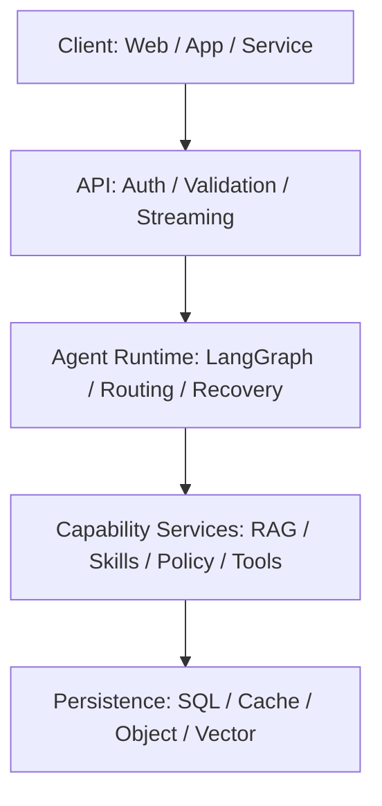

# Enterprise Agent 总体架构

## 文档状态与约定

本文是 `enterprise-agent` 技术文档的总入口，定义全局术语、系统边界、分层依赖、模块职责和系统级质量要求。编排、RAG、Skills、工具安全、评测与部署的实现细节分别由“相关文档”中的专题文档负责。

当前工作区没有项目源码、部署清单或运行证据可供核验。因此：

- **已确认基线**：Python 包名为 `enterprise_agent`；API 采用 FastAPI 风格；编排采用 LangGraph；模型通过统一 LLM factory 适配；部署以 Docker Compose 为基线并保留 Kubernetes 迁移边界。
- **设计约定**：本文使用“必须”“应该”“可以”表达 RFC 2119 风格的强制、推荐和可选要求。除已确认基线外，本文所有规范性架构描述均是待实现和待验收的目标设计。
- **建议实现**：标有“建议实现”的技术、阈值或拓扑是默认起点，可以经架构决策记录（ADR）替换，但替换后仍必须满足模块边界和非功能要求。
- **已实现能力**：只有在源码、自动化测试和部署证据均可追溯时才可标为已实现；本文不声称任何目标能力已经落地。

全局术语固定如下，专题文档不得为同一概念另造同义字段：

| 术语 | 固定含义 | 约束 |
|---|---|---|
| `thread_id` | 一次对话执行线程的稳定标识，也是图执行与恢复的命名空间 | API 创建或接受后必须贯穿 Graph、日志、指标和 checkpoint 查询 |
| `checkpoint` | LangGraph 图状态的持久化快照 | 必须与 `tenant_id`、`thread_id` 和图版本关联，不得包含明文密钥 |
| `tenant_id` | 服务端认证上下文中的租户边界标识 | 必须由可信身份映射产生；不得采用模型生成值作为过滤条件 |
| `approval_id` | 一条人工审批记录的稳定标识 | 必须关联待执行动作、决策人、决策结果、期限和审计事件 |
| `citation` | 最终答案中指向可追溯来源的结构化引用 | 必须能够定位来源对象和片段；不得由模型凭空构造 |

## 目标与非目标

### 目标

- 为企业对话请求提供可恢复的 Agent 编排入口，支持直接回答、RAG、Skill 和受控工具调用。
- 在 API、Agent Runtime、能力服务和持久化之间建立单向、可测试的依赖边界。
- 将租户隔离、最小权限、人工审批、审计、可观测性和幂等恢复作为默认约束。
- 允许替换模型供应商、向量检索实现和基础设施，而不改变业务调用方的核心契约。
- 为开发、评审、安全审查、评测和生产运维提供共同的架构词汇与验收基线。

### 非目标

- 本文不定义 Graph 节点的完整状态迁移、检索算法参数、Skill manifest、工具策略规则、评测指标公式或部署操作步骤；这些内容归专题文档所有。
- 本轮不实现业务代码、数据库迁移、CI 工作流或基础设施资源。
- 本文不绑定单一模型供应商、向量数据库、对象存储或云平台。
- 本文不虚构具体类名、函数签名、数据库表名、线上规模或已上线能力。

## 架构原则

1. **可信边界优先**：模型输出、用户输入、检索内容和外部工具结果均必须按不可信数据处理，不能修改系统指令、身份或授权策略。
2. **显式状态与可恢复执行**：长流程状态必须进入 Graph state，并通过 `checkpoint` 支持中断、重试和恢复；副作用必须具备幂等语义。
3. **分层依赖**：上层只能通过稳定接口调用下层。API 层不得直接访问向量库；领域服务不得绕过 repository 访问具体存储。
4. **策略先于执行**：工具调用必须先完成注册校验、schema 校验、身份授权和策略判断；高风险动作必须取得有效 `approval_id` 后才能执行。
5. **租户隔离不可委托给模型**：`tenant_id` 必须来自可信认证上下文，查询、缓存、向量检索和对象存储必须执行服务端租户约束。
6. **能力可替换**：LLM、embedding、reranker、向量存储和外部工具必须通过适配器或端口隔离供应商差异。
7. **默认可观测**：请求、Graph、检索、Skill、工具、审批和持久化操作必须传播统一关联信息，并输出脱敏日志、指标和 trace。

以下是跨专题文档不得放宽的安全边界：**API 层不得直接访问向量库；工具不得绕过策略层；租户过滤不得依赖模型生成。**

## 系统上下文

系统面向终端用户、业务应用、知识管理员、审批人、安全审计员和运维人员。客户端通过受认证 API 提交请求、接收流式或非流式结果，并在需要时提交审批决定。系统依赖外部身份提供方、模型/embedding 服务、企业知识源和受控业务工具；这些依赖都位于信任边界之外。

主要边界约定如下：

| 边界 | 输入 | 输出 | 信任处理 |
|---|---|---|---|
| Client → API | 用户请求、`thread_id`、审批决定 | 响应流、错误、`citation`、运行元数据 | 必须认证、限流、校验 schema，禁止信任客户端提供的 `tenant_id` |
| API → Agent Runtime | 规范化请求与可信调用上下文 | 最终结果、可恢复中断或受控失败 | 必须传播 `tenant_id`、主体、权限与关联 ID |
| Runtime → 模型/知识/工具 | 最小化上下文、检索请求或已授权动作 | 模型输出、候选片段、工具结果 | 必须设置超时、输出校验、脱敏与审计，不得泄露跨租户数据 |
| 服务 → Persistence | 带租户范围的命令或查询 | 状态、业务对象、审计证据 | repository 必须强制租户过滤并使用最小权限凭据 |

## 逻辑分层

以下是目标逻辑架构；图中的箭头表示允许的主要调用方向，而非已部署拓扑。



1. **Client**：承载人机或服务到服务交互，不参与服务端授权判断。
2. **API**：完成协议适配、认证、请求校验、限流、流式传输和错误映射，不包含检索或工具执行逻辑。
3. **Agent Runtime**：维护 Graph state，执行意图路由、节点编排、checkpoint、中断恢复和最终响应组装。
4. **Capability Services**：提供 RAG、Skill 加载与匹配、LLM 适配、工具策略、审批和工具执行等可组合能力。
5. **Persistence**：通过 repository/adapter 提供关系数据、checkpoint、缓存、对象和向量数据的持久化边界。

## 模块职责

| 逻辑模块 | 核心职责 | 禁止职责 |
|---|---|---|
| API Gateway | 认证、schema 校验、限流、流式响应、协议错误映射 | 不得直接查询向量库或拼装 RAG 上下文 |
| Agent Runtime | Graph 编排、路由、checkpoint、中断与恢复、答案组装 | 不得把模型输出当作授权结论 |
| RAG Service | 知识接入、服务端权限过滤、检索、重排、上下文和 `citation` 构造 | 不得接受未经验证的模型生成 `tenant_id` 作为范围 |
| Skill Registry/Loader | Skill 发现、manifest 校验、版本解析、运行时注册 | 不得隐式授予工具权限 |
| Tool Policy & Approval | 工具注册、风险判定、授权、审批状态和策略决策 | 不得执行工具副作用 |
| Tool Executor | 在策略许可和隔离环境内执行工具，规范化结果 | 不得绕过策略层或复用过期审批 |
| Application Services | 编排会话、消息、文档、知识库、审批等用例 | 不得耦合 HTTP 或具体存储 SDK |
| Repositories/Adapters | 持久化抽象、租户范围查询、事务和供应商适配 | 不得承载 Graph 路由或授权策略 |
| Observability | 结构化日志、指标、trace、审计事件出口与脱敏 | 不得记录密钥、完整令牌或高敏正文 |

## 目录映射

**设计约定**：应用代码应该采用 `src/enterprise_agent/` 布局。下表定义目录职责，而不代表这些目录当前已存在。

| 目录 | 职责 | 依赖边界 |
|---|---|---|
| `api` | FastAPI 风格的路由、依赖注入、请求/响应 schema、认证上下文和错误映射 | 可以调用 `services` 或 Agent 入口；不得访问向量库和具体 repository 实现 |
| `agents` | Agent 配置、运行时外观、LLM factory 调用和响应组装 | 依赖 `graphs` 与能力端口，不依赖 HTTP |
| `graphs` | LangGraph state、节点、路由、子图、checkpoint 和恢复契约 | 通过服务接口调用 RAG、Skills、策略和工具 |
| `rag` | 接入、切分、索引、混合检索、重排、权限过滤、上下文与引用 | 通过 `repositories`/adapter 访问向量和对象存储 |
| `skills` | Skill manifest、loader、registry、匹配、版本与上下文注入 | 工具绑定必须交给策略层验证 |
| `tools` | 工具 schema、registry、策略客户端、审批协作、隔离执行适配器 | 所有执行必须经过策略判断；不得自行扩大权限 |
| `services` | 会话、消息、文档、知识库、审批等应用用例编排 | 调用领域端口与 `repositories`，不依赖 API schema |
| `repositories` | SQL、checkpoint、缓存、对象和向量存储的端口与适配器 | 必须强制租户范围和事务边界 |
| `models` | 领域实体、值对象、持久化映射和公共数据契约 | 不包含网络或存储副作用 |
| `core` | 配置、异常、身份上下文、LLM factory、公共协议和生命周期 | 不包含具体业务用例 |
| `observability` | 日志、指标、trace、审计事件、脱敏和关联上下文 | 只接收必要字段，不保存秘密或高敏正文 |

## 核心数据流

### 在线请求与恢复

1. API 认证调用者，从可信身份映射得到主体和 `tenant_id`，校验请求并绑定或生成 `thread_id`。
2. Application Service 加载会话与必要历史，将规范化输入交给 Agent Runtime；API 不直接访问向量存储。
3. 主图识别意图并路由至直接回答、RAG、Skill 或工具路径。路由结果只是编排信号，不是授权结论。
4. RAG 路径先应用服务端租户和知识库权限过滤，再检索、重排和组装上下文；来源由服务生成结构化 `citation`。
5. 工具路径先做 registry/schema 校验和策略判断。若需要人工审批，Runtime 持久化 `checkpoint` 与审批记录，以 `approval_id` 返回可恢复中断。
6. 审批决定到达后，系统必须校验主体、租户、动作摘要、有效期和当前状态，再从对应 `checkpoint` 恢复。副作用使用幂等键，避免重复执行。
7. Runtime 组装最终答案与 `citation`，持久化消息、Graph 运行元数据、指标和审计事件，再由 API 返回客户端。

任何外部依赖超时、策略拒绝、审批过期或输出校验失败都必须转为结构化受控错误；不得在失败降级时绕过授权、租户过滤或引用校验。

### 离线知识与质量流

知识接入必须在解析与切分后写入带 `tenant_id`、知识库权限和版本元数据的索引；发布候选必须经过离线与在线回归门禁。接入算法归 RAG 文档，指标定义与门禁归评测文档，部署和回滚操作归部署文档。

## 数据与状态

**设计约定**：持久化对象至少包括用户、会话、消息、文档、知识库、审批记录和审计记录；Graph state 通过 `checkpoint` 独立持久化。租户所有的数据模型必须包含或可无歧义地推导 `tenant_id`。

| 数据/状态 | 主标识 | 最低关联字段 | 一致性要求 |
|---|---|---|---|
| 会话与消息 | `session_id` / `message_id` | `tenant_id`、主体、`thread_id`、时间戳 | 消息追加和运行状态更新应该具备事务或补偿语义 |
| Graph 快照 | checkpoint store 内部键 | `tenant_id`、`thread_id`、图版本、步骤、状态版本 | 恢复必须校验图版本；写入必须支持并发控制 |
| 文档与知识库 | `document_id` / `knowledge_base_id` | `tenant_id`、权限、来源、内容版本 | 原文、chunk 和索引必须可追溯到同一版本 |
| 审批记录 | `approval_id` | `tenant_id`、`thread_id`、动作摘要、决策、期限 | 决策必须单调且可审计；重复提交不得重复执行副作用 |
| 审计记录 | `audit_event_id` | `tenant_id`、主体、动作、对象、结果、关联 ID | 必须追加写并受保留策略保护 |
| 引用 | `citation` 内的来源定位 | 来源对象、内容版本、片段定位、显示信息 | 返回答案前必须验证来源仍在调用者可见范围内 |

**接口约定示例**（字段集合示意，不代表已实现 API）：

```json
{
  "thread_id": "thread_example_01",
  "checkpoint": {
    "version": 7,
    "status": "awaiting_approval"
  },
  "tenant_id": "tenant_example",
  "approval_id": "approval_example_01",
  "citations": [
    {
      "source_id": "document_example_01",
      "content_version": "v3",
      "locator": "chunk_0042"
    }
  ]
}
```

`tenant_id` 在外部请求正文中即使出现也只能作为非可信提示；服务端必须用认证上下文中的值覆盖或拒绝不一致请求。日志和 trace 应该只记录必要标识和摘要，不得复制敏感正文。

## 技术选型

| 能力 | 选型状态 | 约定或建议 | 替换边界 |
|---|---|---|---|
| API | 已确认基线 + 设计约定 | 已确认基线：FastAPI 风格；设计约定：支持流式与非流式响应 | 保持认证上下文、错误模型和应用服务契约 |
| Agent 编排 | 已确认基线 + 设计约定 | 已确认基线：LangGraph；设计约定：使用持久化 checkpoint | 保持 Graph state、路由和恢复语义 |
| LLM | 已确认基线 | 统一 LLM factory；模型供应商未绑定 | 适配器必须统一超时、重试、流式、用量和错误类型 |
| 关系数据 | 建议实现 | PostgreSQL | 必须提供事务、迁移、租户范围查询和备份恢复 |
| 缓存/短期协调 | 建议实现 | Redis | 不得作为审批和审计的唯一事实来源 |
| 对象存储 | 建议实现 | S3-compatible API | 必须支持租户命名空间、加密、版本与保留策略 |
| 向量检索 | 建议实现 | 通过 vector repository 适配器选择具体实现 | 必须支持服务端元数据/权限过滤和可追溯定位 |
| 本地部署 | 已确认基线 | Docker Compose，本地与生产配置分离 | Compose 不是生产安全配置的替代品 |
| 编排迁移 | 设计约定 | 保留向 Kubernetes 迁移的健康检查、无状态 API 与外置状态边界 | 迁移不得改变上层业务契约 |

## 横切能力

- **身份与授权**：认证在 API 边界完成，授权在资源或动作边界再次执行；工具执行必须经过策略层，高风险动作必须绑定有效 `approval_id`。
- **多租户隔离**：查询、缓存键、向量检索和对象路径必须携带可信 `tenant_id`；租户过滤不得依赖模型生成。
- **安全输入处理**：用户输入、文档、检索片段和工具输出必须视为不可信数据；提示词内容不得覆盖系统策略或工具权限。
- **可靠性**：外部调用必须设置超时、有限重试与错误分类；应该为不稳定依赖配置熔断。不可重试错误必须立即失败。
- **幂等性**：工具副作用、审批恢复、消息落库和知识接入必须设计幂等键或去重约束。
- **可观测性**：必须用关联 ID 连接 API 请求、`thread_id`、Graph run、检索、模型、工具、`approval_id` 和 audit event；日志与 trace 必须脱敏。
- **配置与秘密**：环境配置必须与代码分离；秘密必须由专用 secret 机制注入，不得写入源码、checkpoint、日志或镜像层。
- **版本兼容**：Graph、Skill、索引 schema、提示词和模型配置应该有显式版本；恢复旧 checkpoint 前必须执行兼容性检查。

## 非功能要求

以下是**设计约定的初始系统级目标**。项目取得基准数据后可以通过 ADR 调整数值，但不能无记录地弱化安全、隔离和审计要求。

| 维度 | 初始目标 | 验证方式 |
|---|---|---|
| 可用性 | 建议实现：生产 API 月度可用性目标不低于 99.9%，计划维护窗口另行定义 | 合成探测与服务端成功率 SLI |
| 延迟 | 建议实现：在固定基准模型、数据集和负载下，非流式端到端延迟与流式首 token 延迟必须建立 p50/p95/p99 基线并设置回归门禁 | 负载测试与在线 histogram；门禁细节由评测文档定义 |
| 恢复 | 所有可恢复 Graph 中断必须持久化 checkpoint；恢复不得重复产生已确认副作用 | 中断注入、重复恢复和幂等性测试 |
| 一致性 | 审批、审计和工具副作用不得以缓存为唯一事实来源；并发恢复必须防止双执行 | 并发与故障注入测试 |
| 安全 | 未注册、越权、参数非法或审批无效的工具调用必须默认拒绝；跨租户读取成功数必须为 0 | 安全单测、集成测试和渗透测试 |
| 可追溯性 | 所有工具调用必须产生审计事件；RAG 答案中的每个 `citation` 必须可回溯到调用者有权访问的来源版本 | 审计对账与 citation 回放 |
| 隐私 | 日志、trace、指标标签和 checkpoint 不得包含密钥、完整令牌或未经批准的高敏正文 | 自动 secret/PII 扫描与抽样审计 |
| 可扩展性 | API 与 Agent worker 应该无本地持久状态并可水平扩展；状态必须外置 | 多实例一致性与扩缩容测试 |
| 可维护性 | 公共契约、Graph、Skill、索引和配置变更必须版本化并有兼容/迁移策略 | 契约测试、迁移演练与 ADR 审查 |
| 可移植性 | 模型、向量存储和对象存储替换不得要求修改 API 及核心用例契约 | adapter 契约测试 |

## 架构决策

下列决策是目标架构的当前约定；涉及范围或取舍变化时必须新增 ADR，而不是只修改实现：

| 决策 | 选择 | 主要理由 | 代价/约束 |
|---|---|---|---|
| ADR-001 分层依赖 | Client → API → Agent Runtime → Capability Services → Persistence | 限制耦合并形成可测试边界 | 跨层数据需要显式契约和映射 |
| ADR-002 显式 Graph state | LangGraph + checkpoint | 支持长流程、中断、审批和恢复 | 必须管理状态版本、并发和幂等性 |
| ADR-003 服务端租户强制 | `tenant_id` 来自认证上下文并由 repository/adapter 强制 | 模型与客户端都不是可信授权源 | 每一种存储实现都需要隔离测试 |
| ADR-004 策略与执行分离 | Policy/Approval 先决策，Executor 后执行 | 默认拒绝并集中审计高风险动作 | 工具接入多一层契约与延迟 |
| ADR-005 供应商适配 | LLM factory 与存储 adapter | 避免核心流程绑定单一供应商 | 只能暴露跨供应商可稳定支持的核心能力 |
| ADR-006 结构化引用 | 由 RAG 服务生成并验证 `citation` | 支持答案来源追溯和权限复核 | 索引必须保留内容版本与定位信息 |

## 演进路线

1. **契约与骨架**：建立 `enterprise_agent` 包边界、统一配置/异常/身份上下文、应用服务端口和 adapter 契约；完成租户隔离威胁建模。
2. **可恢复最小闭环**：实现 API → Graph → LLM 的最小路径、checkpoint、消息持久化、结构化观测和失败恢复测试。
3. **受控能力扩展**：接入带权限过滤与 `citation` 的 RAG、版本化 Skills、工具 registry、策略判断、审批和隔离执行。
4. **质量与生产化**：建立离线/在线评测门禁、压力与故障注入测试、Compose 运维基线、备份恢复和回滚演练。
5. **规模化演进**：根据实际 SLI 决定 worker 拆分、存储扩展与 Kubernetes 迁移；任何拆分必须保留既有契约和审计链路。

每个阶段只有在对应安全、隔离、恢复和可观测性验收通过后才能进入下一阶段；阶段名称不表示当前实现进度。

## 相关文档

- [LangGraph 流程与恢复规范](graph-flow.md)：Graph state、节点、路由、子图、审批中断、checkpoint 与错误语义。
- [RAG 设计](rag-design.md)：知识接入、索引、权限过滤、混合检索、重排、上下文和 `citation`。
- [Skills 开发指南](skills-guide.md)：Skill 结构、manifest、loader、选择、注入、版本和测试。
- [工具安全基线](tool-security.md)：风险分级、策略、授权、审批、沙箱、审计与提示注入防护。
- [评测与质量门禁](evaluation.md)：数据集、指标、测试层级、回归和发布门禁。
- [部署与运维](deployment.md)：环境、Docker Compose、迁移、健康检查、监控、扩缩容、备份和回滚。

## 验收清单

- [ ] 确认所有规范性描述均被理解为“设计约定”或明确标注为“建议实现”，且未将目标能力写成已落地事实。
- [ ] 确认 `thread_id`、`checkpoint`、`tenant_id`、`approval_id` 和 `citation` 的含义与所有专题文档一致。
- [ ] 确认五层 Mermaid 图自上而下可渲染，代码围栏闭合。
- [ ] 确认 `api`、`agents`、`graphs`、`rag`、`skills`、`tools`、`services`、`repositories`、`models`、`core`、`observability` 均有唯一主责。
- [ ] 确认 API 不直连向量库、工具不绕过策略层、租户过滤不依赖模型生成。
- [ ] 对恢复、重复审批回调和工具重试执行幂等性测试，并确认不会重复产生副作用。
- [ ] 对 SQL、缓存、向量检索和对象存储执行跨租户负向测试，跨租户读取成功数必须为 0。
- [ ] 扫描示例、日志字段和 Mermaid 内容，确认没有真实密钥、个人信息或未完成占位标记。
- [ ] 运行文档入口检查：

  ```shell
  rg -n '^## ' docs/architecture.md && \
    rg -n '\]\((graph-flow|rag-design|skill_runtime-guide|tool-security|evaluation|deployment)\.md\)' docs/architecture.md
  ```

- [ ] 在六份专题文档生成后执行相对链接检查，并由架构、安全、开发和运维角色共同评审。