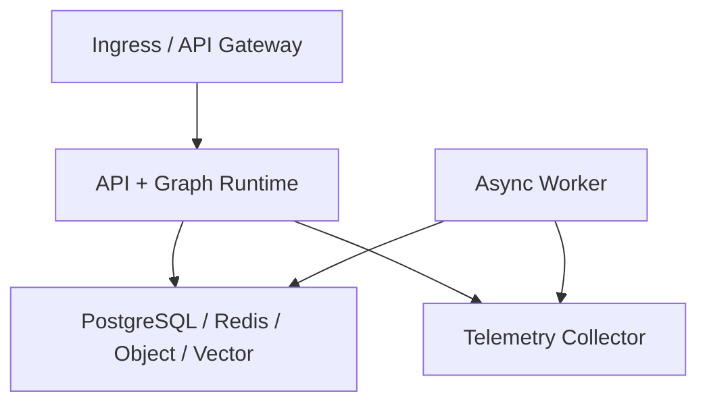

# Enterprise Agent 部署与运维

## 1. 文档状态、目的与范围

本文定义 `enterprise_agent` 的目标部署与运维契约，覆盖 local、test、staging、production 环境，Docker Compose 拓扑，配置与 secret 注入，迁移和启动顺序，健康探针，可观测性与 SLO，发布、回滚、备份恢复及故障处置。

当前工作区没有可核验的应用源码、容器镜像、基础设施清单或生产基线。因此：

- **已确认基线**：本地部署以 Docker Compose 为基线；本地与生产配置分离；API 和 Agent worker 应该无本地持久状态；持久化依赖必须外置。
- **设计约定**：除已确认基线外，本文中的服务名、配置名、镜像入口、探针路径和操作流程都是待实现、测试和验收的目标契约，不表示已经部署。
- **建议实现**：文中的供应商中立组件和运维数值是默认起点，可以经评审后的 ADR 或运行手册变更。
- **阈值声明**：凡标为“建议初始值”的 SLO、告警、容量、超时、保留期、发布观察期、RPO 或 RTO，都必须在生产启用前用脱敏真实流量、容量/故障测试和最近稳定基线校准，并记录负责人、样本窗口、适用环境和复审日期。安全零容忍不变量不是可调阈值。

总体服务边界见[总体架构](architecture.md)，工具凭据、审计与 fail-closed 规则见[工具安全](tool-security.md)，发布门禁及稳定基线定义见[评测体系](evaluation.md)。Graph checkpoint 兼容与恢复语义见[Graph 流程](graph-flow.md)，索引版本和重建语义见[RAG 设计](rag-design.md)。

本文不绑定单一云、模型供应商、对象存储或向量数据库，不定义业务代码、具体 Kubernetes 资源或供应商控制台步骤。

## 2. 部署不变量与责任边界

以下约束适用于所有环境；production 不得用“临时降级”绕过：

1. API、Graph runtime 与 worker 必须从同一不可变应用制品构建，并以不同角色启动；不得依赖容器本地持久状态。
2. `tenant_id` 必须来自受信认证上下文。SQL、Redis 键、对象路径、向量查询和 checkpoint 必须保留租户边界；模型输出不得决定租户范围。
3. PostgreSQL、checkpoint、审批、审计、对象与向量数据必须有明确事实来源。Redis 不得成为审批、审计或工具副作用的唯一事实来源。
4. secret 必须在运行边界由 secret manager、工作负载身份或只读 secret 文件注入；不得写入源码、Compose YAML、镜像层、prompt、日志、trace、checkpoint 或错误正文。
5. 所有工具调用必须经过策略与必要审批；Policy、secret manager 或审计依赖异常时，写操作和高风险调用必须 fail closed，详见[工具安全](tool-security.md)。
6. 发布制品、Graph、数据库 schema、索引 generation、prompt、Skill、工具 registry/Policy 与配置必须版本化并可追溯到同一 release manifest。
7. 迁移和回滚必须保持前后版本兼容；不得用破坏性 down migration 作为常规回滚手段。
8. production 运行身份、数据、密钥、网络与观测后端必须与非生产环境隔离；production 数据不得复制到非生产，除非经过批准且不可逆脱敏。

建议的职责分工如下：发布负责人管理制品和流量，数据库负责人管理 schema/恢复，RAG 负责人管理索引 generation，安全负责人管理 Policy、secret 与安全响应，SRE 管理容量、SLO、告警和灾备演练。职责可以合并，但批准和执行必须满足组织的职责分离要求。

## 3. 环境矩阵

| 维度 | local | test | staging | production |
|---|---|---|---|---|
| 目的 | 开发者调试、契约验证 | 自动化单元/组件/集成测试 | 生产候选、容量、迁移和故障演练 | 受 SLO 约束的真实业务流量 |
| 数据 | 合成数据；每位开发者独立命名空间 | 测试 fixture；用例结束后销毁 | 脱敏且代表性的固定数据集 | 真实数据；按租户、地域和保留策略治理 |
| 应用制品 | 可以本地构建；必须记录依赖 lock 摘要 | CI 构建的不可变候选制品 | 与待发布 production 完全相同的制品摘要 | 只允许门禁通过、签名/摘要验证成功的不可变制品 |
| 模型与工具 | mock、沙箱或隔离开发账户；禁止 production 权限 | 确定性 fake/recorded fixture 为主，必要时用隔离测试账户 | 与 production 同接口和策略版本；目标与凭据仍隔离 | 版本固定的模型适配器；工具使用最小权限的生产身份 |
| 状态依赖 | Compose 内 PostgreSQL、Redis、对象存储、向量后端 | 每次运行独立或临时依赖，禁止共享污染 | production 等价的托管产品与拓扑，独立账户/项目 | 多可用区或等价高可用的托管依赖；备份、PITR 与审计启用 |
| secret 注入 | 未提交的本地 secret 文件或开发者 secret vault | CI secret store 注入临时文件/短期凭据 | staging secret manager + workload identity | production secret manager/HSM/KMS + workload identity；禁止长期静态凭据 |
| 网络 | 默认只绑定开发主机；外部域名 allowlist | 隔离网络；外部依赖默认阻断或模拟 | 与 production 等价的入口、出口、TLS 和 Policy | 私网优先、入口 WAF/API gateway、出口 allowlist、服务间 TLS |
| 可观测性 | 控制台或本地 collector；采样不得泄露正文 | 测试制品保存脱敏日志、指标和 trace | 完整 collector、告警演练与发布观察面板 | 高可用观测出口、告警值班、受控保留和访问审计 |
| 扩缩容 | 单实例足够表达拓扑 | 按测试并发临时扩缩 | 验证水平扩缩、连接池和队列背压 | API 与 worker 独立扩缩；由已校准的容量与 SLO 信号驱动 |
| 生命周期 | 开发者显式启动/销毁 | 测试运行创建并回收 | 每个候选可重建；避免长期漂移 | 变更走发布门禁、审批、观察、回滚和审计流程 |

staging 必须验证“同制品、同迁移、同配置 schema、同探针、同 Policy 接口”，但必须使用不同的数据、租户、域名、凭据、bucket、collection 和审计分区。local/test 的宽松便利配置不得自动继承到 staging/production。

## 4. 配置与 secret 注入

### 4.1 配置加载规则

建议实现统一配置层按“镜像内非敏感默认值 → 环境配置 → secret 文件/工作负载身份”加载。运行时必须：

- 启动时严格校验必填项、类型、枚举、端点 scheme 和互斥项；未知的安全关键配置必须使进程退出。
- 只在日志中记录配置键、来源、版本和不可逆摘要，不得记录 secret 值、完整连接字符串、认证 header 或高敏正文。
- 对动态配置采用版本化快照和原子切换；失败时保留上一份已验证配置。配置变更必须进入与代码发布相同的审计和回滚流程。
- 通过 `*_FILE` 读取 secret 时，只接受由编排器挂载的只读文件；文件权限必须限制到工作负载身份。应用不得把文件内容再写入环境、磁盘或 checkpoint。
- 生产优先使用 workload identity 获取短期凭据。确需 secret manager 引用时，环境变量只保存引用名或挂载路径，不保存 secret 值。

### 4.2 非敏感环境变量

以下变量名为**设计约定**；值列仅给出非敏感示例或约束。任何实际端点若包含用户信息、token 或签名，必须改用 secret 注入。

| 类别 | 变量名 | 含义与非敏感示例/约束 |
|---|---|---|
| 运行 | `APP_ENV` | `local`、`test`、`staging`、`production` 之一 |
| 运行 | `SERVICE_ROLE` | `api`、`worker`、`migration` 或 `index-check` |
| 运行 | `RELEASE_ID` | 不可变 release/镜像摘要的可读标识，不含凭据 |
| 运行 | `LOG_LEVEL` | 受环境策略约束；production 不得启用会记录正文/headers 的 debug |
| 模型 | `LLM_PROVIDER`、`LLM_MODEL`、`LLM_BASE_URL` | 固定 provider/模型版本和不含凭据的 HTTPS endpoint；发布不得使用 `latest` 别名 |
| 模型 | `EMBEDDING_PROVIDER`、`EMBEDDING_MODEL`、`RERANKER_MODEL` | 固定版本；必须进入 release/evaluation manifest |
| SQL | `DB_HOST`、`DB_PORT`、`DB_NAME`、`DB_SSL_MODE` | 非敏感连接坐标；production 必须启用传输加密和证书校验 |
| SQL | `DB_POOL_SIZE`、`DB_POOL_TIMEOUT_SECONDS` | 容量参数；不得提供通用生产默认值，必须经负载与故障测试校准 |
| Redis | `REDIS_HOST`、`REDIS_PORT`、`REDIS_DB`、`REDIS_TLS_ENABLED` | 连接坐标与 TLS 开关；缓存键必须带受信 `tenant_id` 命名空间 |
| 对象存储 | `OBJECT_STORAGE_ENDPOINT`、`OBJECT_STORAGE_REGION`、`OBJECT_STORAGE_BUCKET` | endpoint 不含签名；bucket/前缀按环境与租户隔离 |
| 对象存储 | `OBJECT_STORAGE_VERSIONING`、`OBJECT_STORAGE_KMS_KEY_ID` | production 必须启用版本或等价防误删能力；KMS key ID 是引用，不是密钥值 |
| 向量检索 | `VECTOR_BACKEND`、`VECTOR_ENDPOINT`、`VECTOR_COLLECTION` | 通过 adapter 选择实现；collection 按环境隔离 |
| 向量检索 | `INDEX_GENERATION`、`EMBEDDING_DIMENSION` | 当前可读 generation 与维度；写入新 generation 后再原子切换 |
| checkpoint | `CHECKPOINT_BACKEND`、`CHECKPOINT_NAMESPACE` | namespace 必须隔离环境和 `tenant_id` |
| checkpoint | `GRAPH_VERSION`、`CHECKPOINT_SCHEMA_VERSION` | 恢复前必须验证 Graph/state 兼容性 |
| 认证 | `AUTH_ISSUER`、`AUTH_AUDIENCE`、`AUTH_JWKS_URI` | 固定可信发行方、受众和 HTTPS JWKS endpoint |
| 认证 | `AUTH_TENANT_CLAIM` | 可信身份映射字段；不得接受模型或普通请求正文覆盖 |
| 策略 | `POLICY_ENDPOINT`、`POLICY_BUNDLE_VERSION`、`TOOL_REGISTRY_VERSION` | 固定策略与 registry 版本；未知或不可达时 fail closed |
| secret | `SECRET_MANAGER_PROVIDER`、`SECRET_MANAGER_MOUNT` | secret manager 类型和只读挂载根；不包含 secret 内容 |
| 观测 | `OTEL_SERVICE_NAME`、`OTEL_EXPORTER_OTLP_ENDPOINT` | 服务名与无凭据 OTLP endpoint |
| 观测 | `OTEL_RESOURCE_ATTRIBUTES` | 仅允许低基数的环境、服务、release、region；禁止用户/目标/正文 |
| 观测 | `TRACE_SAMPLE_RATE` | 采样参数；属于建议运维阈值，必须按成本、调查能力与合规要求校准 |
| 观测 | `METRICS_EXPORT_INTERVAL_SECONDS` | 导出周期；属于建议运维阈值，必须按告警时效和后端容量校准 |

### 4.3 敏感变量与注入方式

下表**只列变量名/引用名和注入方式，不提供值、格式示例或默认凭据**。同一进程只应挂载其角色需要的最小集合。

| 类别 | 敏感变量名或引用 | 允许的注入方式 |
|---|---|---|
| 模型 | `LLM_API_KEY_FILE`、`EMBEDDING_API_KEY_FILE`、`RERANKER_API_KEY_FILE` | secret manager 投影为只读文件，或 workload identity 换取短期 token |
| SQL | `DATABASE_DSN_FILE`、`DATABASE_PASSWORD_FILE` | 编排器 secret volume/secret CSI 只读挂载；优先 workload identity 数据库认证 |
| checkpoint | `CHECKPOINT_DSN_FILE`、`CHECKPOINT_ENCRYPTION_KEY_FILE` | secret manager 按应用角色与环境挂载；不得从旧 checkpoint 恢复密钥 |
| Redis | `REDIS_PASSWORD_FILE`、`REDIS_URL_FILE` | secret manager 只读文件；若 URL 含认证信息，必须整体视为 secret |
| 对象存储 | `OBJECT_STORAGE_ACCESS_KEY_ID_FILE`、`OBJECT_STORAGE_SECRET_ACCESS_KEY_FILE` | 优先 workload identity；否则由 secret manager 注入短期最小权限凭据 |
| 向量检索 | `VECTOR_API_KEY_FILE`、`VECTOR_DSN_FILE` | secret manager 只读文件或 workload identity；不得进入索引 manifest |
| 认证 | `AUTH_CLIENT_SECRET_FILE`、`SESSION_SIGNING_KEY_FILE` | secret manager/HSM；轮换需支持重叠验证期并记录 key ID |
| 加密/TLS | `DATA_ENCRYPTION_KEY_FILE`、`TLS_CA_FILE`、`TLS_CERT_FILE`、`TLS_KEY_FILE` | KMS/HSM 引用、certificate manager 或只读内存/文件挂载；私钥不得进入镜像 |
| 策略与审计 | `POLICY_CLIENT_CREDENTIAL_FILE`、`AUDIT_SINK_DSN_FILE` | workload identity 或 secret manager；审计不可用时按安全基线 fail closed |
| OTLP | `OTEL_EXPORTER_OTLP_HEADERS_FILE`、`OTEL_EXPORTER_OTLP_CERTIFICATE_FILE` | collector/应用专用 secret 挂载；认证 header 不得进入普通环境转储 |

secret 的创建、读取、轮换、撤销和失败必须产生独立审计事件。secret scanner 必须覆盖镜像层、Compose 渲染结果、日志、trace、checkpoint、错误正文和发布制品；命中任何真实或 canary secret 都必须阻断发布并启动安全响应。

## 5. 服务拓扑与 Docker Compose 示例

### 5.1 目标拓扑



API 处理认证、协议和同步/流式 Graph 请求；worker 处理离线接入、索引、异步任务和可恢复后台执行。两者使用相同 release 制品但独立扩缩。外部模型、身份提供方、Policy/Approval、secret manager 和受控工具位于图外的受信边界，必须通过 TLS、最小身份、超时和出口 allowlist 访问。

### 5.2 Compose 示意配置

下例是 **local 环境的设计示例**，用于表达依赖关系与 secret 文件注入，不是已经可运行的项目清单。应用镜像需要提供 `api`、`worker`、`migrate` 和 `index-check` 四个入口；collector 配置文件需要由实现仓库提供。`.local-secrets/` 必须位于版本控制忽略规则内且权限受限，文件内容不得写入本文或 Compose YAML。

```yaml
name: enterprise-agent

x-app-common: &app-common
  image: enterprise-agent:${RELEASE_ID:-local}
  restart: unless-stopped
  environment: &app-environment
    APP_ENV: local
    RELEASE_ID: ${RELEASE_ID:-local}
    DB_HOST: postgres
    DB_PORT: "5432"
    DB_NAME: enterprise_agent
    DATABASE_DSN_FILE: /run/secrets/database_dsn
    CHECKPOINT_DSN_FILE: /run/secrets/checkpoint_dsn
    REDIS_HOST: redis
    REDIS_PORT: "6379"
    OBJECT_STORAGE_ENDPOINT: http://object-storage:9000
    OBJECT_STORAGE_BUCKET: enterprise-agent-local
    OBJECT_STORAGE_ACCESS_KEY_ID_FILE: /run/secrets/object_access_key_id
    OBJECT_STORAGE_SECRET_ACCESS_KEY_FILE: /run/secrets/object_secret_access_key
    VECTOR_BACKEND: qdrant
    VECTOR_ENDPOINT: http://vector:6333
    VECTOR_COLLECTION: enterprise-agent-local
    INDEX_GENERATION: local-v1
    OTEL_SERVICE_NAME: enterprise-agent
    OTEL_EXPORTER_OTLP_ENDPOINT: http://telemetry:4317
  secrets:
    - database_dsn
    - checkpoint_dsn
    - object_access_key_id
    - object_secret_access_key
  depends_on:
    postgres:
      condition: service_healthy
    redis:
      condition: service_healthy
    object-storage:
      condition: service_healthy
    vector:
      condition: service_healthy

services:
  postgres:
    image: postgres:16
    environment:
      POSTGRES_DB: enterprise_agent
      POSTGRES_USER: enterprise_agent
      POSTGRES_PASSWORD_FILE: /run/secrets/postgres_password
    secrets:
      - postgres_password
    volumes:
      - postgres-data:/var/lib/postgresql/data
    healthcheck:
      test: ["CMD-SHELL", "pg_isready -U $${POSTGRES_USER} -d $${POSTGRES_DB}"]

  redis:
    image: redis:7-alpine
    command: ["redis-server", "--appendonly", "yes"]
    volumes:
      - redis-data:/data
    healthcheck:
      test: ["CMD", "redis-cli", "ping"]

  object-storage:
    image: minio/minio:RELEASE.2025-04-22T22-12-26Z
    command: ["server", "/data", "--console-address", ":9001"]
    environment:
      MINIO_ROOT_USER_FILE: /run/secrets/object_access_key_id
      MINIO_ROOT_PASSWORD_FILE: /run/secrets/object_secret_access_key
    secrets:
      - object_access_key_id
      - object_secret_access_key
    volumes:
      - object-data:/data
    healthcheck:
      test: ["CMD", "mc", "ready", "local"]

  vector:
    image: qdrant/qdrant:v1.14.1
    volumes:
      - vector-data:/qdrant/storage
    healthcheck:
      test: ["CMD-SHELL", "bash -c ':> /dev/tcp/127.0.0.1/6333'"]

  telemetry:
    image: otel/opentelemetry-collector-contrib:0.125.0
    command: ["--config=/etc/otelcol-contrib/config.yaml"]
    configs:
      - source: telemetry-config
        target: /etc/otelcol-contrib/config.yaml

  migrate:
    <<: *app-common
    restart: "no"
    command: ["migrate"]

  index-check:
    <<: *app-common
    restart: "no"
    command: ["index-check"]
    depends_on:
      migrate:
        condition: service_completed_successfully
      vector:
        condition: service_healthy

  api:
    <<: *app-common
    command: ["api"]
    environment:
      <<: *app-environment
      SERVICE_ROLE: api
    depends_on:
      migrate:
        condition: service_completed_successfully
      index-check:
        condition: service_completed_successfully
      telemetry:
        condition: service_started
    ports:
      - "127.0.0.1:8080:8080"
    healthcheck:
      test: ["CMD", "python", "-c", "import urllib.request; urllib.request.urlopen('http://127.0.0.1:8080/readyz')"]

  worker:
    <<: *app-common
    command: ["worker"]
    environment:
      <<: *app-environment
      SERVICE_ROLE: worker
    depends_on:
      migrate:
        condition: service_completed_successfully
      index-check:
        condition: service_completed_successfully
      telemetry:
        condition: service_started

volumes:
  postgres-data:
  redis-data:
  object-data:
  vector-data:

configs:
  telemetry-config:
    file: ./deploy/telemetry-collector.yaml

secrets:
  postgres_password:
    file: ${LOCAL_SECRET_DIR:-.local-secrets}/postgres_password
  database_dsn:
    file: ${LOCAL_SECRET_DIR:-.local-secrets}/database_dsn
  checkpoint_dsn:
    file: ${LOCAL_SECRET_DIR:-.local-secrets}/checkpoint_dsn
  object_access_key_id:
    file: ${LOCAL_SECRET_DIR:-.local-secrets}/object_access_key_id
  object_secret_access_key:
    file: ${LOCAL_SECRET_DIR:-.local-secrets}/object_secret_access_key
```

Compose 中镜像版本是用于语法和拓扑审查的建议 pin，采用前必须完成镜像来源、签名、SBOM、漏洞和许可证校验。健康检查时序沿用运行时默认值只是 local 便利行为；staging/production 的 interval、timeout、failure threshold 与 startup grace period 都是建议运维阈值，必须依据依赖启动分布和故障注入结果校准。

### 5.3 production 托管替换

production 不应直接复制 local Compose 的单节点状态组件。应用层保持相同端口/adapter 契约，并按下表替换：

| Compose 组件 | production 建议替换 | 必须保留的契约 |
|---|---|---|
| `api` / `worker` | Kubernetes、受管容器平台或等价编排器 | 同一不可变制品、独立角色、无本地持久状态、工作负载身份、readiness、滚动/蓝绿流量控制 |
| `postgres` | 多可用区托管 PostgreSQL 或等价事务数据库 | 事务、迁移锁、PITR、TLS、最小权限、租户范围查询和可恢复 checkpoint |
| `redis` | 高可用托管 Redis 或等价缓存/协调服务 | TLS、认证、租户命名空间、容量/淘汰可见；不得成为审批/审计唯一事实来源 |
| `object-storage` | 托管 S3-compatible 对象存储 | 租户前缀/策略、静态与传输加密、版本、生命周期、事件和恢复能力 |
| `vector` | 托管向量服务或 PostgreSQL vector adapter | ACL/`tenant_id` 预过滤、generation 别名原子切换、快照或从对象源重建、可追溯 locator |
| `telemetry` | 高可用 agent/gateway collectors + 受控日志/指标/trace 后端 | 本地缓冲上限、背压、TLS、脱敏、访问控制、保留和告警；观测故障不得拖垮请求路径 |
| 本地 secret 文件 | secret manager/HSM/KMS + workload identity | 只读最小投影、短期凭据、轮换、撤销、访问审计和 fail-closed |

切换托管实现前必须通过 adapter 契约、租户隔离、故障注入、性能、备份恢复和成本测试；不得让供应商特有 SDK 泄漏到 API 或核心用例契约。

## 6. 数据库与索引迁移

### 6.1 expand-migrate-contract

所有数据库、checkpoint state 和跨版本数据变更必须遵循 **expand-migrate-contract**，并在 release manifest 中记录阶段与兼容矩阵：

1. **Expand**：先添加可空列、新表、新索引或兼容读路径；旧版本必须能够继续读写。禁止同一 release 删除/重命名旧字段或收紧约束。
2. **Migrate**：通过可重入、可暂停的后台任务回填数据。任务必须带稳定游标、幂等键、速率限制、进度/错误指标和租户边界；失败不得阻断旧版本服务。
3. **Dual-read/write（按需）**：在受控窗口内验证新旧表示一致；差异必须可观测且不能用缓存掩盖。
4. **Switch**：候选应用在配置或 feature flag 下读取新表示；完成质量门禁和观察后才能成为稳定基线。
5. **Contract**：只有确认所有运行实例、旧 checkpoint、回滚窗口、报表和运维工具都不再依赖旧表示后，才能在独立 release 删除旧字段/索引。Contract 前必须完成可恢复备份和批准。

迁移必须使用数据库级互斥锁或等价 leader 机制，避免并发执行；运行身份只拥有迁移所需权限。schema 迁移失败、锁异常、校验不一致或 migration version 未知时必须停止候选发布，保持旧版本流量和旧兼容 schema 可用。不得自动执行破坏性回滚；优先修复 forward 或撤走候选应用。

checkpoint schema/Graph version 变更必须提供旧状态读取、显式转换或拒绝恢复的策略。拒绝必须保留审计证据并给出受控用户结果，不能静默丢弃等待审批的线程。

### 6.2 索引 generation 迁移

向量索引必须采用不可变 `index_generation`：

1. 从已版本化对象源和 parser/chunk/embedding manifest 构建新 generation，旧 generation 继续服务。
2. 在受信 `tenant_id` 与 ACL 预过滤条件下运行完整性、维度、数量、locator、引用可达和离线 RAG 回归检查。
3. 通过[评测体系](evaluation.md)的 RAG/安全门禁后，原子切换只读别名或配置指针；禁止原地覆盖稳定 generation。
4. 观察期内保留旧 generation，候选异常时把指针切回并清理应用缓存。删除旧 generation 必须晚于已校准回滚窗口和备份验证。

维度、embedding 模型、距离函数、metadata schema 或 ACL 语义任一不兼容都必须构建新 generation。索引检查失败时 API/worker 的相关 RAG 路径不得 readiness 放行；系统可以按预先批准的安全降级返回“知识服务暂不可用”，但不得绕过 ACL 或引用校验。

## 7. 启动顺序与健康探针

### 7.1 启动状态机

启动顺序必须固定为：

1. **依赖就绪**：DNS/TLS、PostgreSQL、checkpoint、Redis、对象存储、向量、Policy、secret manager 和 telemetry 的最小连接/权限检查成功。
2. **数据库迁移**：单实例执行 expand 阶段的兼容迁移并校验 schema version；失败立即停止发布。
3. **索引兼容性检查**：验证 `INDEX_GENERATION`、embedding 维度、metadata/ACL schema、对象源版本和引用定位；失败不得放行 RAG 路径。
4. **API/worker 启动**：加载并校验配置、Graph/Skill/Policy/registry 版本，初始化连接池，不接受业务流量。
5. **readiness 放行**：只有角色所需的强依赖和版本契约都满足，实例才进入负载均衡或消费队列。
6. **发布观察**：合成探测、在线门禁和告警无异常后，才继续流量晋级或宣布候选稳定。

停止顺序应该先撤销 readiness/暂停领取新任务，再排空连接和可安全完成的工作，持久化 checkpoint/游标，最后关闭进程。带副作用且结果未知的工具调用必须标为 `unknown` 并按幂等键核对，不得因 shutdown 自动重试。

### 7.2 探针契约

探针响应不得包含配置值、依赖凭据、租户数据、异常堆栈或内部网络拓扑。HTTP 状态和稳定 reason code 足以供编排器判断；详细诊断进入受控、脱敏的日志/trace。

| 探针 | 作用 | 成功条件 | 失败动作 |
|---|---|---|---|
| `/livez` | 进程是否存活、事件循环是否响应 | 仅检查本进程；不探测外部依赖 | 连续失败后由编排器重启；failure threshold 是建议值，需校准 |
| `/readyz` | 是否可接收该角色的新流量 | 配置有效、必需 secret 引用可用、schema/Graph/Policy/registry/index 兼容、关键连接池可用 | 立即摘除流量/暂停队列；不得用重启掩盖持续依赖故障 |
| `/startupz` | 慢启动是否仍在正常推进 | 迁移已由独立 job 完成，应用正在有界加载配置、连接和版本 | 超过 startup grace period 才重启；grace period 是建议值，需按启动分布校准 |
| 合成业务探测 | 认证到 Graph、受控 RAG/Policy 路径是否端到端工作 | 使用隔离合成租户、无真实副作用，响应和审计可关联 | 触发告警/停止流量晋级；频率和超时为建议值，需按成本与发现时效校准 |

readiness 只检查当前角色的强依赖。例如 Redis 缓存不可用时，若经容量验证存在安全的直连降级，API 可以保持就绪并暴露 degraded 指标；Policy、认证、租户过滤、必要审计、数据库/checkpoint 或索引 ACL 兼容不可用时，不得以“可用性”为由放行受影响路径。

## 8. 可观测性、SLO 与容量

### 8.1 关联、日志与 trace

入口必须生成或验证 `trace_id`，并将 `thread_id`、可信 `tenant_id`、Graph run ID、`approval_id`、tool call ID、release、Graph version、index generation 和 Policy version 贯穿 API、worker、依赖调用、审计与 trace。

- 结构化日志必须使用字段 allowlist 与 secret/PII scanner 双重脱敏；禁止记录 prompt、完整消息/文档正文、完整 token、连接字符串、认证 header、模型隐藏推理或工具敏感原参。
- `tenant_id`、`thread_id` 和 `trace_id` 可以作为受控日志关联字段，但不得直接作为高基数指标 label；指标使用环境、服务、角色、route、status、risk、dependency、release 等有界标签。
- trace span 应覆盖 API admission、Graph 节点、模型/embedding/reranker、RAG 召回/重排、Policy/Approval、工具执行、checkpoint、SQL/Redis/对象/向量依赖；span attribute 必须脱敏。
- 审批 wall-clock 等待必须与 active latency 分开；长等待不能掩盖运行时性能，也不能误报成请求超时。
- telemetry 故障必须可观测并有受保护的有界缓冲；缓冲满时不得耗尽应用磁盘/内存。安全审计不可用时的行为以[工具安全](tool-security.md)为准。

### 8.2 指标目录

| 域 | 必须观测的信号 |
|---|---|
| API/请求 | request count、成功/预期拒绝/无答案/非预期错误、p50/p95/p99 active latency、流式首 token、断连、限流、在途请求 |
| Graph 节点 | 节点 count/latency/error/retry、route 分布、run duration、checkpoint write/load、恢复结果、重复副作用与幂等 `unknown` |
| 模型 | provider/model/version、调用量、p50/p95/p99 latency、timeout、retry、token、限流、成本、降级路径；不得用 prompt 作标签 |
| RAG | ACL 预过滤结果、召回/重排 latency、候选与上下文数量、no-answer、citation 可达/覆盖抽样、index generation、接入队列和失败 |
| 工具与审批 | risk、`allow/deny/require_approval`、schema/Policy/sandbox 阻断、执行状态/latency、审批待处理/过期/绑定失配、审计写入和幂等冲突 |
| 依赖 | PostgreSQL/Redis/对象/向量/Policy/secret/telemetry 的 availability、latency、连接池/队列、timeout、熔断、容量、复制/备份状态 |
| 资源与容量 | CPU、内存、文件描述符、网络、容器重启、worker backlog/age、数据库连接/锁/存储、缓存命中/淘汰、对象/向量容量 |

所有计数器、histogram bucket、队列 age、连接池饱和和容量水位的告警值都是建议运维阈值，必须用容量测试、故障注入、业务峰值和告警噪声校准。未定义基线前应收集分布，不得用任意通用数值作为生产自动扩缩或发布判定。

### 8.3 建议 SLO

下表全部是**未校准的建议初始值**，不是当前已达到的承诺。团队必须按本文“阈值声明”校准后写入版本化 SLO；安全不变量单列且不可由错误预算抵消。

| SLI | 建议初始 SLO | 计算边界与校准要求 |
|---|---|---|
| API 可用性 | production 月度不低于 **99.9%** | 成功或预期受控结果 / 合格请求；计划维护窗口需预先定义，认证失败、策略拒绝、无答案与系统错误分开。用真实业务权重和依赖故障预算校准 |
| 非预期错误率 | 月度低于 **0.1%** | 5xx、未分类依赖失败和内部超时 / 合格请求；不得把降级、拒绝或丢失样本静默移出分母。用历史分布和业务损失校准 |
| 流式首 token P95 | active latency 不高于 **3 秒** | 固定 route/model/区域/负载切片；审批等待不计入 active latency。用模型与网络基线校准 |
| 非流式端到端 P95 | active latency 不高于 **15 秒** | 按 direct/RAG/Skill/tool 分切片；审批 wall-clock 单报。用代表性负载和长尾校准 |
| checkpoint 恢复正确性 | **100%** 的可恢复测试产生与一次正确执行等价的状态，重复副作用为 **0** | 这是可靠性与安全验收建议目标；必须通过崩溃、重放和并发故障注入校准覆盖，不得用总体平均掩盖失败 |
| 安全关键结果 | 未授权召回/执行、secret 暴露、跨租户读取和重复副作用均为 **0**；安全关键用例通过率 **100%** | 继承[评测体系](evaluation.md)的强制发布门禁，不是可放宽的 SLO；分母为 0、扫描器失败或审计断链都不能算通过 |

建议实现多窗口错误预算告警：短窗口捕获快速燃烧、长窗口捕获持续退化。窗口、burn-rate、最小样本数、抑制和通知级别全部属于建议阈值，必须用流量模型与演练校准；低流量环境优先结合合成探测，不得因分母小而自动报绿。

## 9. 发布与回滚

### 9.1 发布制品与门禁

每个 release manifest 必须固定并关联：镜像 digest/签名/SBOM、依赖 lock、数据库 migration head、Graph/checkpoint schema、prompt、Skill 内容摘要、模型精确版本、工具 registry/Policy、sandbox profile、RAG parser/chunk/embedding/reranker、`index_generation`、配置 schema、评测报告和批准记录。

上线前必须满足[评测体系](evaluation.md)的全部阻断门禁。其数值门禁均为尚未校准的建议初始值：任务成功率相对稳定基线下降不超过 **2 个百分点**，P95 active latency 恶化不超过 **15%**，单请求平均成本增加不超过 **20%**，error rate 增幅不超过 **0.5 个百分点**；团队必须用真实基线校准且不得在看到候选失败后临时放宽。安全关键用例 **100%**、未授权召回/执行/secret 暴露/重复副作用为 **0** 是强制零容忍门禁。

### 9.2 发布流程

可以选择滚动或蓝绿发布；涉及 Graph/checkpoint、数据库 schema、索引或高风险工具策略的变更，建议优先蓝绿：

1. 验证 release manifest、签名、SBOM、secret 扫描、兼容矩阵和变更审批。
2. 先执行 expand migration 和新 index generation 构建；旧应用与旧索引继续服务。
3. 在 staging 使用同一制品执行迁移、恢复、租户隔离、对抗、容量和回滚演练，并完成离线门禁。
4. 部署无流量的新实例，等待 startup/liveness/readiness 和合成探测通过。
5. 按预注册的流量阶梯做 canary/滚动，或蓝绿切换；每一阶比较同时间窗口的候选与控制组。
6. 每一阶必须检查安全、错误、P95/P99、成本、依赖、队列、审计、checkpoint 和 citation 指标。观察期和流量阶梯均是建议阈值，必须在发布前按流量与故障发现时间校准，不能在发布中临时缩短。
7. 通过完整观察期后更新稳定基线；contract migration 和旧索引清理必须在独立 release、回滚窗口结束且恢复验证成功后执行。

shadow 只允许无副作用的只读候选；写工具、消息发送、资金或特权操作必须使用隔离模拟器。任何安全零容忍失败必须立即停止候选流量，不能等待样本累积或用其他指标抵消。

### 9.3 回滚矩阵

| 变更面 | 回滚动作 | 兼容与证据要求 |
|---|---|---|
| 应用镜像 | 将流量切回最近稳定 digest；停止新 worker 取任务，排空或 checkpoint 当前工作 | 旧实例仍能读写 expand 后 schema；保留候选日志、trace、manifest 和失败窗口 |
| 配置/feature flag | 原子切回上一份已验证配置版本 | 配置 schema 向后兼容；不得恢复已撤销 secret 或弱化 Policy |
| 数据库 schema | 撤走候选并保持 expanded schema；通过 forward fix 修复 | 禁止自动 destructive down migration；若数据错误，先隔离写入并按审计证据恢复 |
| Graph/checkpoint | 切回兼容 Graph version；暂停不兼容线程并走显式转换/人工恢复 | 不得丢弃等待审批状态；恢复前核对图版本、授权绑定和幂等结果 |
| RAG 索引 | 原子把读别名切回稳定 `index_generation` 并清缓存 | 旧 generation、对象源和 manifest 仍可用；继续执行 ACL 与 citation 校验 |
| 模型/prompt/Skill | 切回 manifest 中的稳定精确版本 | 重新运行受影响 route 的门禁；不得用 `latest` 解析为不确定对象 |
| Tool/Policy/secret | 立即撤销有风险版本或凭据，切回仍受支持的安全版本 | 安全响应优先于可用性；旧 checkpoint 执行前仍须复核当前 registry、Policy、身份和审批 |

回滚触发必须预注册：安全不变量失败、审计断链或跨租户迹象立即回滚并安全响应；SLO、成本、队列或依赖退化超过已校准门限时暂停晋级或回滚。回滚本身失败时进入故障指挥流程，冻结非必要变更，保留证据并优先阻断新增副作用。

## 10. 备份、恢复与灾备

### 10.1 保护范围

| 资产 | 建议保护方式 | 恢复验证 |
|---|---|---|
| PostgreSQL 业务/审批/审计元数据 | 加密全量备份 + 连续 WAL/PITR；备份账户与运行账户分离 | 在隔离环境恢复到目标时间，校验 schema、租户计数、审批/审计完整性与应用只读查询 |
| checkpoint store | 若在 PostgreSQL 中随数据库保护；否则独立一致性快照和日志 | 重放等待审批、错误恢复、重复 callback 与幂等场景，验证 Graph version 兼容 |
| 对象存储 | 版本控制、跨故障域复制或等价不可变备份、生命周期与删除保护 | 抽样/全量校验 digest、版本、租户前缀、ACL 和 citation locator |
| 向量索引 | 保留稳定 generation 快照；同时以对象源和不可变 ingestion manifest 作为重建来源 | 对比 document/chunk 数、维度、ACL metadata、检索黄金集与 citation 可达 |
| Redis | 一般按可丢缓存/可重建协调数据设计；确需持久队列时单独定义事实来源和恢复 | 清空缓存后的冷启动、限流、锁和任务去重测试，不允许审批/审计丢失 |
| release/evaluation/配置 manifest | 加密、版本化、不可变制品库 | 按 digest 重建稳定 release，验证签名、Policy、索引和配置引用均可解析 |
| secret/KMS 元数据 | 由 secret manager/HSM 的备份与灾备能力保护；应用备份只保存引用 | 在不导出明文 secret 的情况下验证轮换、撤销和恢复访问；密钥丢失场景有批准流程 |

备份必须加密、访问受控、与生产故障域隔离、具备删除保护和访问审计。备份任务“成功”不等于可恢复；必须按已校准频率执行自动完整性检查与隔离恢复演练。备份频率、保留期、跨区副本数和演练周期都是建议阈值，必须依据法规、数据变化率、成本和业务影响校准。

### 10.2 建议 RPO/RTO

以下全部是**未校准的建议初始值**，需由业务、数据、安全与 SRE 依据依赖能力和恢复演练共同批准：

| 服务/数据 | 建议 RPO | 建议 RTO | 校准与降级说明 |
|---|---|---|---|
| 核心 API + PostgreSQL/checkpoint | 不超过 **15 分钟** | 不超过 **60 分钟** | 用真实写入速率、PITR 间隔、数据库大小和跨故障域演练校准；未恢复 checkpoint 前暂停需要恢复/审批的线程 |
| 对象源与审计证据 | 不超过 **15 分钟** | 不超过 **4 小时** | 合规或不可抵赖要求可能需要更严格 RPO；恢复前不得返回 citation 或完成审计对账 |
| 向量检索 | 不超过 **60 分钟** | 不超过 **8 小时** | 若可从对象源重建，RPO 取决于 ingestion manifest；恢复期间只能按批准策略关闭 RAG，不得绕过 ACL 或伪造 citation |
| Redis 缓存 | 可以为 **24 小时** 或完全重建 | 不超过 **60 分钟** | 仅在 Redis 不承载唯一事实时成立；按冷启动负载与依赖保护能力校准 |

如果经业务影响分析得出的目标比依赖产品能力更严格，必须先改造复制、日志、容量或架构，再承诺 SLO；不得只在文档中缩短数值。

### 10.3 恢复顺序

1. 宣布事件、冻结发布和非必要写入，确定恢复时间点与证据保留范围。
2. 恢复网络、DNS、身份、KMS/secret manager 和审计出口；验证工作负载身份，不导出明文 secret。
3. 在隔离环境恢复 PostgreSQL 与 checkpoint，先做一致性、租户边界、schema/Graph version 和审批状态检查。
4. 恢复对象源并核对版本/digest/ACL；再恢复稳定向量快照或从已验证 manifest 重建索引。
5. 清空或重建 Redis 缓存，避免旧租户缓存、旧 Policy 或旧索引 generation 污染恢复环境。
6. 部署最近稳定 release，执行 migration/index compatibility、readiness、合成租户、安全和只读业务验证。
7. 分阶段开放流量和写入；对账消息、审批、审计、工具幂等记录、citation 和数据缺口。
8. 记录实测 RPO/RTO、数据损失、人工步骤与改进项。未通过恢复验收不得销毁隔离副本或宣布结束。

恢复演练必须覆盖数据库不可用、区域故障、对象误删、索引损坏、secret 撤销、审计不可用和部分恢复后的跨租户负向测试。恢复脚本与权限必须定期验证，但不得在 production 直接做破坏性演练。

## 11. 扩缩容与依赖保护

- API 依据请求并发、CPU/内存、active latency 和连接池饱和独立扩缩；worker 依据队列 backlog/age、任务时长、依赖配额和幂等能力扩缩。
- 自动扩缩目标、最小/最大副本、冷却期、队列阈值和连接池大小全部是建议容量阈值，必须通过代表性峰值、冷启动和依赖故障测试校准。
- 总数据库连接上限必须按所有 API/worker/迁移实例和管理余量统一预算；扩容不得把压力直接转移为数据库、模型、Policy 或向量服务雪崩。
- 外部调用必须设置连接/读取/总超时、有限重试、指数退避、熔断和并发舱壁。具体数值均为建议阈值，必须按幂等性、provider 配额、P95/P99 和故障注入校准；不可重试错误和未知副作用不得重试。
- worker 必须具备背压、可见队列年龄、租户公平性和 poison message 隔离；任务租约超时后先核对 checkpoint/幂等结果。
- 扩缩容和故障降级不得绕过认证、租户 ACL、Policy、审批、审计、secret 或 citation 校验。

## 12. 上线前检查清单

### 制品与配置

- [ ] release manifest 已固定镜像 digest/签名/SBOM、依赖、Graph/checkpoint、模型/prompt/Skill、工具/Policy、索引、配置与评测版本。
- [ ] staging 使用与 production 相同的候选制品；production 专属域名、数据、租户、身份、secret 和审计分区未泄漏到非生产。
- [ ] 配置 schema 严格校验通过，敏感值只由 secret manager/workload identity/只读 secret 文件注入；镜像、YAML、日志、trace 和 checkpoint secret 扫描通过。
- [ ] 容量、健康检查、自动扩缩、告警和 SLO 的建议阈值已用真实基线校准并有负责人、适用范围和复审日期；安全零容忍门禁未被豁免。

### 数据、迁移与恢复

- [ ] expand migration 在 staging 和 production 影子/只读检查通过；旧版本与 expanded schema 的读写兼容已验证，迁移锁和失败停止路径有效。
- [ ] 新 `index_generation` 的对象源、parser/chunk/embedding、ACL metadata、引用定位和 RAG 回归通过；稳定 generation 仍可原子回切。
- [ ] Graph/checkpoint 兼容矩阵覆盖运行中、等待审批、失败恢复和重复 callback；副作用恰好一次或明确 `unknown`。
- [ ] 最近备份完整性和隔离恢复演练有证据，实测 RPO/RTO 满足已批准目标；回滚窗口内没有提前执行 contract 或删除旧索引。

### 安全、质量与观测

- [ ] [评测体系](evaluation.md)的复现、任务、RAG、Agent、安全、延迟和成本阻断门禁全部有充分证据；`inconclusive`/`invalid_run` 未被当作通过。
- [ ] 未授权召回/执行、跨租户读取、secret 暴露和重复副作用为 0；Policy、secret manager 或必要审计异常时 fail-closed 已演练。
- [ ] `/livez`、`/readyz`、`/startupz` 与合成租户探测有效，响应不泄漏内部配置；发布面板按 release/route/dependency 可切片。
- [ ] `trace_id`、`thread_id`、`tenant_id`、Graph run、`approval_id`、tool call、audit event 与 release 可关联，日志/trace/指标标签脱敏检查通过。
- [ ] 值班、发布负责人、数据库/RAG/安全联系人、回滚权限、事件频道和状态沟通模板已确认。

## 13. 故障处置检查清单

### 发现与控制

- [ ] 宣布事件等级和指挥者，记录开始时间、影响环境/租户/route/release，并冻结非必要发布与配置变更。
- [ ] 以 `trace_id`、release、Graph version、`index_generation`、Policy version 和依赖状态定位范围；证据必须脱敏并受访问控制。
- [ ] 若存在跨租户、未授权执行、secret/canary 命中、审批绑定失配、重复副作用或审计断链，立即停止相关流量/worker、撤销凭据并启动安全响应。
- [ ] 先摘除未就绪实例、停止领取新任务和新增副作用；不要通过无限重启、无限重试或关闭 Policy/ACL/审计来“恢复可用”。

### 缓解与恢复

- [ ] 对照回滚矩阵切回最近稳定应用、配置、Policy 或 `index_generation`；数据库保持 expanded schema，禁止即兴 destructive down migration。
- [ ] 工具超时或崩溃窗口内的副作用先按幂等键查询；未知状态标记 `unknown` 并人工核对，不得盲重试。
- [ ] 需要灾备时按身份/secret → PostgreSQL/checkpoint → 对象源 → 向量 → Redis → 应用顺序恢复，并在隔离环境验证租户、审批、审计和 citation。
- [ ] 只有 readiness、合成探测、安全断言、对账和已校准在线门限满足后才分阶段恢复流量；观察窗口不得在事件中临时缩短。

### 结束与复盘

- [ ] 对账请求、消息、checkpoint、审批、审计、工具幂等记录、文档/对象、索引和 citation；记录实际数据损失与实测 RPO/RTO。
- [ ] 保留脱敏 manifest、日志、trace、指标窗口、变更和时间线；依法隔离高敏证据，不把 secret 或正文复制到普通工单。
- [ ] 完成根因、促成因素、探测/响应缺口、纠正项、责任人和期限；将可复现失败加入评测、故障注入或恢复演练集。
- [ ] 重新通过门禁和规定观察期后才更新稳定基线；未完成安全补救不得仅因流量恢复而关闭事件。

## 14. 实现与验证清单

- [ ] local、test、staging、production 的数据、身份、secret、网络、依赖与生命周期明确隔离。
- [ ] 模型、SQL、Redis、对象、向量、checkpoint、认证、加密、Policy 和 telemetry 配置都有严格 schema，敏感值仅通过受控机制注入。
- [ ] Compose YAML 不含真实凭据，拓扑包含 API/Graph、worker、PostgreSQL、Redis、对象、向量与 telemetry collector。
- [ ] production 托管替换保留 adapter、租户 ACL、备份恢复、工作负载身份和健康探针契约。
- [ ] expand-migrate-contract、索引 generation、启动顺序、readiness 与失败停止流程已自动化并演练。
- [ ] 指标覆盖请求、Graph、模型、RAG、工具、审批、依赖和容量；`trace_id`、`thread_id`、`tenant_id` 可关联且不进入高基数标签。
- [ ] 所有数值型运维阈值均明确为建议初始值并有真实基线校准流程；安全零容忍不变量保持强制。
- [ ] 滚动/蓝绿、质量门禁、回滚矩阵、备份恢复、RPO/RTO、上线和故障清单均有责任与证据要求。
- [ ] 本文相对链接、Mermaid、Markdown 围栏和 Compose YAML 已通过静态验证。