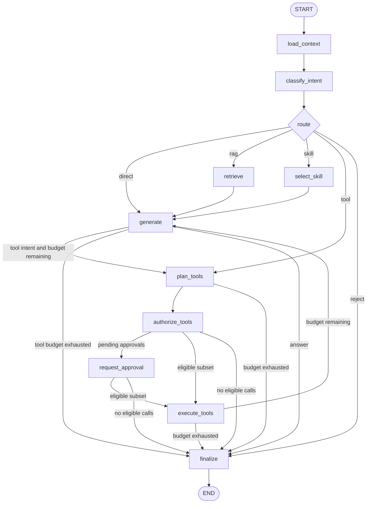
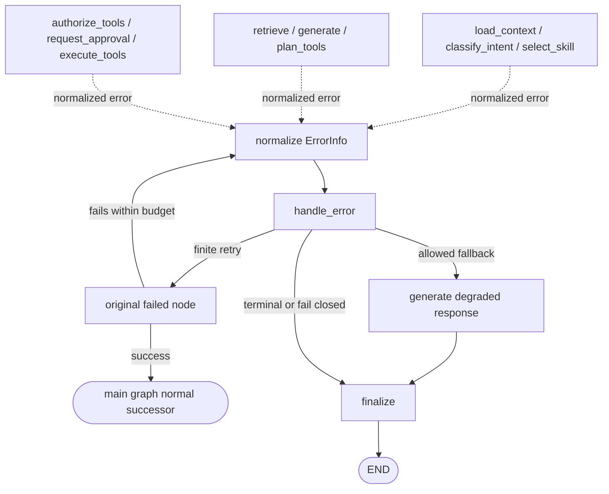
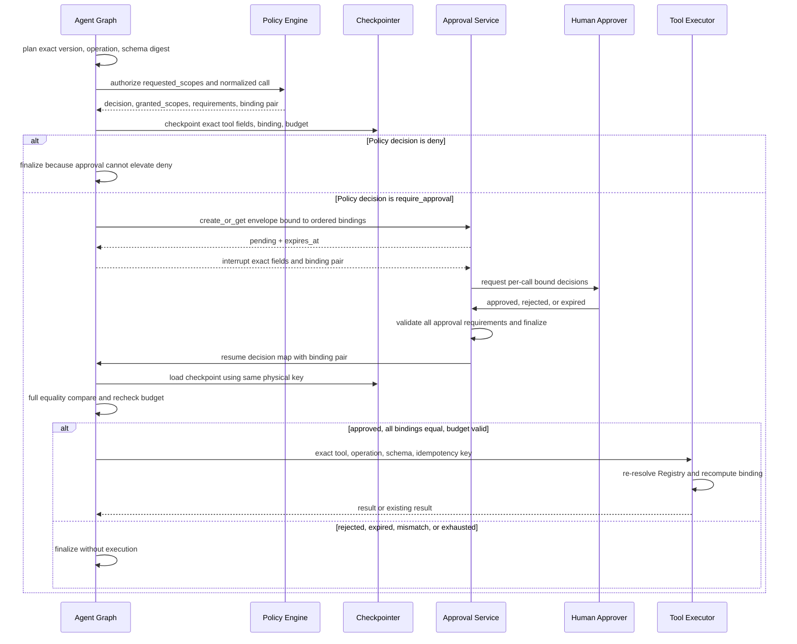

# LangGraph 编排流程规范

## 1. 文档状态与约定

本文定义 `enterprise_agent` 的 Graph State、节点、路由、人工审批、中断恢复和错误语义，是 [总体架构](architecture.md) 中 Agent Runtime 的实现级约束。

当前工作区未提供 `enterprise_agent` 项目源码，因此本文除 LangGraph 公共 API 语义外，所有项目字段、节点、路由和持久化行为均为**设计约定**，不表示已经实现。带“建议实现”的参数和技术选项必须通过集成测试、故障演练和容量评测后再确定。

规范词含义如下：

- **必须**：兼容性、安全性或可恢复性所需的强制要求。
- **应该**：推荐的默认做法；偏离时应该记录理由。
- **可以**：按业务需要选择的扩展能力。

## 2. 目的与范围

本文用于让开发者能够实现并评审以下边界：

- API 已完成身份校验，并将可信的 `tenant_id`、`user_id` 和 `thread_id` 传入 Agent Runtime。
- 主图把请求固定路由为 `direct`、`rag`、`skill`、`tool` 或 `reject`。
- RAG、Skill 和工具系统通过明确的节点契约接入，不在本文重复其内部算法。
- 高风险工具在策略判断后写入 `checkpoint`，通过人工审批中断，并使用同一租户与逻辑 `thread_id` 派生的物理 key 恢复。
- 最终答案、引用、运行元数据、审批和审计记录具有明确的提交边界。

本文不定义检索算法、Skill 包生命周期、工具风险分级和沙箱细节；这些内容分别由 `rag-design.md`、`skills-guide.md` 和 `tool-security.md` 负责。

## 3. 核心不变量

以下均为设计约定：

1. 逻辑 `thread_id` 必须由服务端创建或校验，并在租户范围内唯一；checkpointer 只能使用服务端从可信 `tenant_id` 与逻辑 ID 派生的物理 key，客户端值不得绕过会话所有权检查。
2. `checkpoint` 是单个执行线程的图状态快照，不是跨线程长期记忆。生产环境必须使用持久化 checkpointer。
3. 节点只返回状态增量，不得原地修改输入状态；并行写同一字段时必须使用确定性 reducer。
4. 所有工具调用必须经过 `authorize_tools`；模型、Skill 和恢复请求都不得直接调用 `execute_tools`。
5. 工具副作用必须以稳定 `idempotency_key` 防重；Graph 重试、进程崩溃和重复审批回调不得产生重复副作用。
6. `checkpoint`、日志和追踪信息必须脱敏，不得保存密钥、完整令牌、高敏正文或未裁剪的工具输出。
7. `interrupt()` 是正常控制流，不得被 `handle_error` 当作异常或失败审计。
8. 工具安全绑定必须使用 `binding_schema` 与 `authorization_binding_digest`；`parameter_digest` 只能审计诊断，审批不得提升 Policy `deny`。

## 4. AgentState 状态模型

### 4.1 Python 接口约定

下例是待项目实现的**接口约定**。具体消息类型和序列化器可以替换，但字段语义必须保持兼容。

```python
from __future__ import annotations

from typing import Annotated, Any, Literal, TypedDict

from langchain_core.messages import BaseMessage
from langgraph.graph.message import add_messages


Route = Literal["direct", "rag", "skill", "tool", "reject"]


class ResourceOperationScope(TypedDict, total=False):
    resource_type: str
    resource_id: str
    selector: dict[str, Any]
    operation: str


class ApprovalRequirements(TypedDict):
    required_approver_scope: str
    separation_of_duties: dict[str, bool]
    required_approver_auth_strength: str
    min_distinct_approvers: int
    approvals_required: int


class AuthorizationValidity(TypedDict):
    not_before: str
    expires_at: str
    max_uses: int


class ToolCallPlan(TypedDict):
    round_id: str
    call_id: str
    tool_name: str
    tool_version: str
    operation: str
    tool_schema_digest: str
    arguments: dict[str, Any]       # 已完成 schema 规范化；不得含 secret
    requested_scopes: list[ResourceOperationScope]
    granted_scopes: list[ResourceOperationScope] | None
    risk_level: str
    idempotency_key: str
    estimated_cost_units: int
    binding_schema: str             # plan_tools 时固定为受支持版本
    # plan_tools 时下列字段为 None；Policy 决策后一次性写入绑定值。
    policy_decision: Literal["allow", "deny", "require_approval"] | None
    approval_requirements: ApprovalRequirements | None
    validity: AuthorizationValidity | None
    authorization_binding_digest: str | None


class ToolAuthorization(TypedDict):
    call_id: str
    tool_name: str
    tool_version: str
    operation: str
    tool_schema_digest: str
    requested_scopes: list[ResourceOperationScope]
    granted_scopes: list[ResourceOperationScope]
    parameter_digest: str           # 仅用于受限审计/诊断，不是安全绑定
    policy_version: str
    decision: Literal["allow", "deny", "require_approval"]
    reason_code: str
    approval_requirements: ApprovalRequirements | None
    validity: AuthorizationValidity
    binding_schema: str
    authorization_binding_digest: str
    approval_id: str | None


class ApprovalDecision(TypedDict):
    call_id: str
    approval_id: str
    tool_name: str
    tool_version: str
    operation: str
    tool_schema_digest: str
    requested_scopes: list[ResourceOperationScope]
    granted_scopes: list[ResourceOperationScope]
    policy_decision: Literal["require_approval"]
    approval_requirements: ApprovalRequirements
    validity: AuthorizationValidity
    decision: Literal["approved", "rejected", "expired"]
    parameter_digest: str           # 仅用于受限审计/诊断，不是安全绑定
    binding_schema: str
    authorization_binding_digest: str
    decided_at: str


class ExecutionBudget(TypedDict):
    max_tool_rounds: int
    max_tool_calls: int
    deadline_at: str
    max_cost_units: int
    tool_rounds_used: int
    tool_calls_used: int
    cost_units_used: int
    counted_round_ids: list[str]
    counted_call_ids: list[str]


class Citation(TypedDict):
    document_id: str
    document_version: str
    chunk_id: str
    title: str
    locator: str
    score: float


def merge_citations(
    left: list[Citation], right: list[Citation]
) -> list[Citation]:
    """按稳定来源键去重；实现必须再保证确定性排序。"""
    merged = {
        (item["document_version"], item["chunk_id"], item["locator"]): item
        for item in [*left, *right]
    }
    return [merged[key] for key in sorted(merged)]


class ErrorInfo(TypedDict):
    category: str
    safe_message: str
    retryable: bool
    attempt: int
    node: str
    correlation_id: str


class AgentState(TypedDict, total=False):
    messages: Annotated[list[BaseMessage], add_messages]
    tenant_id: str
    user_id: str
    thread_id: str
    intent: str
    route: Route
    selected_skill: dict[str, str] | None
    retrieval_context: list[dict[str, Any]]
    pending_tool_calls: list[ToolCallPlan]
    executable_tool_calls: list[ToolCallPlan]
    tool_authorizations: dict[str, ToolAuthorization]
    approval_id: str | None
    approval_decisions: dict[str, ApprovalDecision]
    execution_budget: ExecutionBudget
    citations: Annotated[list[Citation], merge_citations]
    error: ErrorInfo | None
    response_metadata: dict[str, Any]
```

`tenant_id`、`user_id`、`thread_id` 是可信运行上下文，必须由 `load_context` 对 API 身份和会话记录交叉校验，不能从模型输出回填。状态中的 `thread_id` 是租户内的逻辑线程 ID；它不能直接作为 checkpointer 的物理键。`response_metadata` 应该只包含可返回或可观测的低敏字段，例如 `route`、模型别名、耗时、token 计数、`trace_id` 和降级标记。

### 4.2 reducer 规则

| 字段 | reducer 约定 | 原因与约束 |
|---|---|---|
| `messages` | 使用 `add_messages`，以消息 ID 合并或替换 | 支持追加消息和对既有消息的确定性更新；不得直接拼接重复工具结果。 |
| `citations` | 按 `(document_version, chunk_id, locator)` 去重后稳定排序 | 恢复和重试时不得产生重复引用；并行写必须得到相同顺序。 |
| `response_metadata` | 建议实现为浅合并，冲突键由后写节点覆盖 | 节点只写自己负责的键；禁止并行节点写同一键。 |
| `retrieval_context` | 整体替换 | 防止新查询混入旧上下文；进入新一轮检索前必须清空。 |
| `pending_tool_calls` | 整体替换 | `plan_tools` 固定名称、精确版本、operation、schema digest 与 requested scopes；Policy 后只允许一次性填充 granted scopes、原始 decision、审批资格/有效期和 binding digest，基础计划字段变化必须重新规划。 |
| `executable_tool_calls` | 整体替换 | 只能由授权/审批路由器从逐项决策派生；不得直接复制全部待执行计划。 |
| `tool_authorizations`、`approval_decisions` | 按 `call_id` 整体替换 | 每次更新必须写入完整映射，恢复后可以无歧义重建可执行子集。 |
| `execution_budget` | 单写者整体替换，计数器只增不减 | 上限在首次运行固定；重复恢复按 `round_id`/`call_id` 去重计数，不得重置或退款。 |
| 其余标量 | 单写者、后写覆盖 | 图结构必须避免同一 super-step 中并行冲突。 |

如果未来引入并行检索或并行工具调用，必须为被并行写入的字段提供满足结合律、交换律且可重放的 reducer，并增加乱序与重复写测试。

### 4.3 物理 checkpoint key

**设计约定：**生产 checkpointer 的物理 `thread_id` 必须固定为 `checkpoint_thread_id = cp_v1_<base64url(length_prefix(tenant_id, logical_thread_id))>`。其中两个 ID 都来自服务端可信上下文，先编码为 UTF-8 字节，再分别加 2 字节无符号大端长度前缀后连接；单个 ID 必须为 1–64 字节。长度前缀使映射无歧义，`cp_v1_` 用于版本识别。客户端不得提供或覆盖物理键。

```python
import base64

from langgraph.types import Command, interrupt


def checkpoint_thread_id(tenant_id: str, logical_thread_id: str) -> str:
    tenant = tenant_id.encode("utf-8")
    logical = logical_thread_id.encode("utf-8")
    if not 1 <= len(tenant) <= 64 or not 1 <= len(logical) <= 64:
        raise ValueError("checkpoint identity length is invalid")
    payload = (
        len(tenant).to_bytes(2, "big")
        + tenant
        + len(logical).to_bytes(2, "big")
        + logical
    )
    token = base64.urlsafe_b64encode(payload).rstrip(b"=").decode("ascii")
    return f"cp_v1_{token}"


def checkpoint_config(tenant_id: str, logical_thread_id: str) -> dict:
    return {
        "configurable": {
            "thread_id": checkpoint_thread_id(tenant_id, logical_thread_id)
        }
    }
```

首次运行、审批恢复、状态查询和线程删除必须调用同一个 `checkpoint_config(trusted_tenant_id, logical_thread_id)`；checkpointer adapter 只接受派生后的物理键。查询或删除前必须先从认证上下文取得 `tenant_id` 并校验会话所有权，不能先按逻辑 `thread_id` 加载 checkpoint 再检查租户。物理键虽是编码而非秘密，但仍不得作为跨租户可枚举的公共 API 标识。

必须有跨租户负向契约测试：租户 A 和 B 使用相同 `logical_thread_id` 时派生的物理键必须不同；A 的首次写入、恢复、查询或删除都不能观察、覆盖或删除 B 的 checkpoint，反向亦然。

### 4.4 checkpoint 持久化边界

生产 checkpointer 必须以派生的物理键隔离访问，并对静态加密、传输加密、保留期和删除策略负责。建议实现将全部 `AgentState` 字段序列化到 checkpoint，但应在写入前执行以下裁剪：

- `messages`：保存完成恢复所需的消息与工具结果摘要；超长历史由会话存储维护，不在状态中无限增长。
- `retrieval_context`：只保存有长度上限的片段、来源标识和权限快照摘要；高敏正文可以只保存受控引用句柄。
- `pending_tool_calls`：保存 `tool_name`、精确 `tool_version`、单一 `operation`、`tool_schema_digest`、规范化参数或加密引用、`requested_scopes`、风险、`idempotency_key`；Policy 后再一次性写入 `granted_scopes`、原始 decision、完整审批资格/有效期、`binding_schema` 与 `authorization_binding_digest`。密钥和认证材料必须在执行时从 secret manager 注入。
- `tool_authorizations`、`approval_decisions`：按 `call_id` 保存相同的工具版本/operation/schema、`requested_scopes`/`granted_scopes`、Policy decision、完整审批资格、有效期、`binding_schema`、`authorization_binding_digest` 与审批终态；不得只写入通用元数据。
- `parameter_digest`：可以保存为受限审计或诊断索引，但不得作为审批创建、恢复、路由或执行的安全绑定，也不得替代 `authorization_binding_digest` 的全等比较。
- `execution_budget`：保存首次运行固定的上限、绝对 `deadline_at`、单调计数器和已计数 ID；审批等待和恢复都不得重建预算。
- `error`：只保存安全错误类别、关联 ID 和重试元数据；堆栈与原始依赖响应进入受限诊断系统。
- `approval_id`：只保存审批记录 ID；审批决定、审批人事实、有效期/次数、完整资格及同一 binding 二元组由独立审批事实库持久化，checkpoint 保留恢复所需的绑定型投影。

状态恢复必须同时验证当前 actor 仍属于 `tenant_id`、Policy/Graph/审批/executor 的 `binding_schema` 与 `authorization_binding_digest` 全等，且 `thread_id` 未被关闭或迁移。不能仅凭 checkpoint 中的旧授权或相同 `parameter_digest` 继续执行。

## 5. 命令与恢复模型

LangGraph 的配置项 `thread_id` 用于定位 checkpointer 中的线程状态；在本文中该配置项必须填入上一节派生的物理键，而 `AgentState.thread_id` 保留逻辑 ID。`interrupt()` 暂停图执行，恢复时以同一个物理键配置传入 `Command(resume=...)`。以下是符合本文语义的**建议实现**，版本升级时必须按锁定的 LangGraph 版本验证：

```python
def request_approval(state: AgentState) -> dict:
    # 一个 approval_id 是本轮待审批调用的批量传输信封；逐 call_id 决策。
    request = create_or_get_approval(state)
    items = [
        {
            "call_id": item.call_id,
            "tool_name": item.tool_name,
            "tool_version": item.tool_version,
            "operation": item.operation,
            "tool_schema_digest": item.tool_schema_digest,
            "requested_scopes": item.requested_scopes,
            "granted_scopes": item.granted_scopes,
            "policy_decision": item.policy_decision,
            "approval_requirements": item.approval_requirements,
            "validity": item.validity,
            "binding_schema": item.binding_schema,
            "authorization_binding_digest": item.authorization_binding_digest,
            "redacted_summary": item.redacted_summary,
        }
        for item in request.items
    ]
    decisions: list[ApprovalDecision] = interrupt(
        {
            "approval_id": request.approval_id,
            "binding_schema": "enterprise-agent.authorization-binding/v1",
            "items": items,
            "ordered_membership_digest": request.ordered_membership_digest,
            "expires_at": request.expires_at,
        }
    )
    verified = verify_approval_decisions(state, decisions)
    return {
        "approval_id": request.approval_id,
        "approval_decisions": {item["call_id"]: item for item in verified},
    }


config = checkpoint_config(trusted_tenant_id, logical_thread_id)

# 首次运行，遇到 interrupt 后返回待审批信息。
graph.invoke(initial_state, config=config)

# 审批服务原子落库后，用同一物理键恢复；查询和删除也复用 config。
graph.invoke(Command(resume=verified_decisions), config=config)
```

节点在恢复时可能从节点开头重新执行，因此 `interrupt()` 之前的审批记录写入、审计写入等副作用必须幂等。`Command(resume=...)` 的内容只能由受信审批适配器构造；API 不得把客户端 JSON 原样转发给图。恢复值经验证后必须保留在 `approval_decisions`，条件路由不能只保留 `approval_id` 后丢失实际决定。

`ordered_membership_digest` 必须使用版本化 `enterprise-agent.approval-membership/v1` 协议，对信封中按 `call_id` 稳定排序的 `(call_id, tool_name, tool_version, operation, tool_schema_digest, binding_schema, authorization_binding_digest)` 完整元组计算；成员增加、删除或任一字段变化都必须产生不同摘要。该 v1 协议保护按 `call_id` 规范化后的成员集合，不绑定 UI 呈现顺序；UI 可以调整展示顺序，但审批提交前必须重新按 `call_id` 规范化并核对成员摘要。它只保护批次成员关系，每个成员的安全范围仍以 `authorization_binding_digest` 为准；不得把逐项 `parameter_digest` 拼接成成员摘要。

## 6. 节点与路由契约

### 6.1 固定路由结果

主请求路由结果只允许以下五种值：

| 路由 | 含义 | 首个业务节点 |
|---|---|---|
| `direct` | 无需外部知识或工具的直接回答 | `generate` |
| `rag` | 需要企业知识检索 | `retrieve` |
| `skill` | 命中已注册并校验的 Skill | `select_skill` |
| `tool` | 需要一个或多个工具调用 | `plan_tools` |
| `reject` | 请求违规、越权、不可支持或无法安全处理 | `finalize` |

`allow`、`deny`、`require_approval` 是工具策略决定，不是主请求路由结果；不得混入上述枚举。

### 6.2 节点表

下表是 `enterprise_agent.graphs` 的设计约定。节点必须只读取列出的必要状态，并返回最小状态增量。

| 节点 | 必要输入 | 输出状态增量 | 副作用与约束 | 正常后继 |
|---|---|---|---|---|
| `load_context` | API identity、逻辑 `thread_id`、输入消息 | `tenant_id`、`user_id`、规范化 `messages`、首次运行的 `execution_budget`、基础 `response_metadata` | 校验会话归属、通过固定映射取得物理 checkpoint key、加载有界上下文；恢复时不得重建预算 | `classify_intent` |
| `classify_intent` | `messages`、可信身份上下文 | `intent`、`route` | 输出必须按固定枚举校验；低置信度或策略命中时默认 `reject` | 由 `route` 决定 |
| `select_skill` | `intent`、`messages`、租户允许的 Skill 集 | `selected_skill` | 只选择已注册、版本有效且对当前租户可见的 Skill；不得在此授予工具权限 | `generate`；需工具时转 `plan_tools` |
| `retrieve` | `tenant_id`、`user_id`、查询、知识库 scope | `retrieval_context`、`citations` | RAG 必须在召回前执行 ACL 过滤；检索内容一律视为不可信数据 | `generate` |
| `generate` | `messages`、可选 Skill、可选检索上下文 | assistant 消息、`response_metadata`；可选工具意图 | 必须区分指令与不可信上下文；若产生工具意图，只能转为计划，不能执行 | `finalize` 或 `plan_tools` |
| `plan_tools` | `intent`、消息、已固定 Skill、`execution_budget` | 含精确 `tool_version`/`operation`/`tool_schema_digest` 的 `pending_tool_calls`、单调预算 | 从 Skill `required_tools` operation allowlist、active Registry 与租户可见集的交集解析唯一精确版本；规范化参数并预占预算，禁止 `latest` 或模糊版本 | `authorize_tools` 或预算终止后 `finalize` |
| `authorize_tools` | actor、tenant、固定 Skill、规范化调用计划 | 按 `call_id` 的 `tool_authorizations`、回写绑定后的计划、可选 `approval_id`、初始可执行子集 | 对每个调用生成含正式 `requested_scopes`/`granted_scopes`、Policy decision 和完整审批资格的 binding；默认 `deny`，类型化结果进入 checkpoint | 有待审批项到 `request_approval`；否则有可执行项到 `execute_tools`；其余到 `finalize` |
| `request_approval` | 精确工具字段、逐项授权 binding、有序成员摘要、有效期 | `approval_id`、按 `call_id` 的绑定型 `approval_decisions`、重算的可执行子集 | interrupt 信封携带每项 `binding_schema`/`authorization_binding_digest`；恢复时全等比较 Policy、Graph、审批和受信重算值 | 有有效可执行项到 `execute_tools`；其余到 `finalize` |
| `execute_tools` | 绑定后的 `executable_tool_calls`、逐项授权/审批、`execution_budget` | 工具消息、结果摘要、执行元数据 | 重新解析相同精确工具版本，复核 active、operation allowlist、`tool_schema_digest` 与 authorization binding 全等；`deny` 永不执行 | 未超预算时 `generate`；预算耗尽到 `finalize` |
| `finalize` | 最终消息、`citations`、route、错误/降级状态 | 完整 `response_metadata`、API `citation`、对外响应 | 映射并复核引用，持久化最终消息和指标；只返回允许的元数据 | `END` |
| `handle_error` | 规范化异常上下文、当前节点、attempt | `error`、降级或终止标记 | 按错误分类决定有限重试、回退或终止；写脱敏审计，不处理 `interrupt()` | 重试原节点、回退节点或 `finalize` |

路由器必须对未知值执行 fail closed：记录 `ValidationError` 并进入 `handle_error`，不得猜测最近似路由。

### 6.3 精确工具计划与 authorization binding

`plan_tools` 必须消费已固定 `(skill_name, skill_version, content_digest)` 的 Skill，并将 `required_tools[*].operations` 视为候选 operation allowlist，而非授权。每个调用必须按以下顺序解析：Skill 允许的工具/operation ∩ active Tool Registry 精确版本 ∩ 当前租户可见集合；结果必须唯一。缺失、歧义、`latest`/范围版本、operation 不在 allowlist、版本撤销或 schema 无法固定时，必须产生 `ValidationError` 并 fail closed。

成功计划必须在 `ToolCallPlan` 中固定 `tool_name`、精确 `tool_version`、单一 `operation`、`tool_schema_digest`、规范化 `arguments` 和正式复数字段 `requested_scopes`。`tool_schema_digest` 来自解析到的 Registry revision，不得由 Skill、模型或客户端生成。`authorize_tools` 只能进一步收紧 scope；其 `granted_scopes` 必须是 `requested_scopes` 与当前权限的子集，且 scope 项的 `operation` 必须等于计划的单一 `operation`。

授权、审批、Graph checkpoint/interrupt/恢复和执行的唯一安全绑定是 `binding_schema = "enterprise-agent.authorization-binding/v1"` 与 `authorization_binding_digest`。必须由平台唯一库 `enterprise_agent.tools.authorization_binding_v1` 生成和验证；`parameter_digest` 仅可用于受限审计/诊断，不能决定审批资格、恢复路由或执行。

该 binding 必须覆盖 [工具安全基线](tool-security.md) 的完整输入：可信 actor 与 `tenant_id`、`auth_context_digest`、正式 `requested_scopes`/`granted_scopes`、工具名/精确版本/制品摘要与 `tool_schema_digest`、单一 `operation`、目标、完整规范化参数、risk、策略版本、Policy 原始 `decision`、完整 `approval_requirements`、`idempotency_key`、`not_before`/`expires_at`/`max_uses`。`approval_requirements` 至少覆盖审批人 scope、职责分离与禁止自批、审批认证强度、最少不同审批人数和所需批准次数；任一审批资格条件只能通过新的 binding schema/version 扩展，不能留在未绑定的 UI 默认值中。

执行前必须重新读取/重算，并对 Policy 决策记录、Graph checkpoint、interrupt/恢复信封、审批聚合与每条审批人决定、executor 当前值的 `binding_schema` 和 `authorization_binding_digest` 做常量时间**全等比较**。任何工具版本、operation、schema/制品、scope、身份、目标、参数、risk/policy、Policy decision、审批资格、幂等键或有效期变化，都必须使旧 binding 失效并重新经过 Registry、Schema Validation、Identity/Scope 和 Policy Engine；新结果仍为 `require_approval` 时必须创建新审批，不能沿用旧 `approval_id`。

`deny` 是不可提升终态：`authorize_tools` 不得为 `decision = deny` 创建审批信封，`request_approval` 必须拒绝附加到 deny binding 的任何决定，Graph 不得把 `approved` 回调转换为可执行状态，executor 也不得接收该项。审批只能证明原始 `require_approval` binding 的全部资格条件已满足，不能改写 Policy decision 或扩大 `granted_scopes`。

执行前还必须从 Registry 重新解析同一个精确 `tool_version`，确认版本仍 active、`operation` 仍在固定 Skill allowlist、当前 `tool_schema_digest` 与计划值全等。撤销、版本漂移、operation 变化或 schema digest 变化必须拒绝执行并重新规划、授权，必要时重新审批，不能在旧 binding 下静默刷新。

### 6.4 多调用授权与审批聚合

本文固定采用“**逐调用决策、单次批量呈现、可执行子集聚合**”规则；批量呈现不等于整批原子批准。

1. `authorize_tools` 必须为每个 `call_id` 写入一个 `ToolAuthorization`，其中精确工具字段、复数 scope、Policy decision、审批资格、有效期和 binding 不可变。缺失记录、重复 `call_id`、binding 不全等或未知 decision 一律按 `deny` 处理。
2. 若任一调用为 `require_approval`，`authorize_tools` 必须先分配稳定 `approval_id` 并写入对应授权记录；本轮所有 `allow` 调用也先等待，不提前执行。`approval_id` 标识一次审批信封；信封的有序成员摘要覆盖所有待审批 `call_id` 的精确工具字段和 authorization binding。
3. 审批人对信封内每个 `call_id` 分别给出 `approved`、`rejected` 或 `expired`，决定记录必须引用同一 binding。未返回、重复、越界、绑定失配或资格不满足的项按 `rejected` 处理并记录审计；Policy `deny` 项不得进入信封。
4. 恢复路由器按下表派生 `executable_tool_calls`，不得把原始 `pending_tool_calls` 直接传给 executor。

| 策略决定 | 审批决定 | 是否进入 `executable_tool_calls` | 后继 |
|---|---|---|---|
| `allow` | 不需要 | 是 | 无待审批项时 `execute_tools`；否则等待同轮信封完成 |
| `deny` | 任意/不存在 | 否 | 记录拒绝；无其他可执行项时 `finalize` |
| `require_approval` | `approved` 且仍有效 | 是 | `execute_tools` |
| `require_approval` | `rejected` | 否 | 无其他可执行项时 `finalize` |
| `require_approval` | `expired` 或缺失 | 否 | 无其他可执行项时 `finalize` |

对只含一个 `require_approval` 调用的计划，恢复路由是唯一的：`approved -> execute_tools`，`rejected -> finalize`，`expired -> finalize`。混合计划只能改变可执行子集的大小，不能改变任何单项的资格判定。

计划中若调用之间存在顺序依赖、必须全成或全败的事务语义，`plan_tools` 必须拒绝并要求拆成单调用轮次；本文不允许用逐项审批模拟跨工具事务。即使混合结果中仍有可执行子集，`deny`、`rejected`、`expired` 对应的 `call_id` 也永远不能进入 `execute_tools`。

### 6.5 工具循环预算

`generate -> plan_tools -> authorize_tools -> execute_tools -> generate` 必须受 checkpoint 内 `execution_budget` 约束。首次运行固定以下上限，运行中不得上调：工具轮次 4、计划调用总数 8、从首次进入 Graph 起 120 秒绝对时限、成本单位 100。部署可以通过受审配置为**新运行**选择更低值；审批恢复和旧 checkpoint 继续执行时不得重置、延长或替换上限。

- `plan_tools` 为每一轮生成稳定 `round_id`，并在授权前按 `counted_round_ids`、`counted_call_ids` 去重后单调预占轮次、调用数和 `estimated_cost_units`；被拒绝或失败的预占不退款。
- `deadline_at` 是首次运行计算并持久化的绝对时间，审批等待也计入 120 秒。恢复后必须使用原值，不得从“当前时间 + 120 秒”重算。
- `plan_tools` 必须在预占前计算 `projected_rounds`、`projected_calls`、`projected_cost_units`；只有任一投影值**超过**对应上限时才拒绝，恰好等于上限必须完成预占并允许进入授权和执行。成本边界采用相同规则：累计预占成本恰为 100 可以继续，下一次正成本预占导致大于 100 时终止。
- `request_approval` 恢复路由和 `execute_tools` 对已预占离散预算只检查 `used > max`，并逐项校验本轮 `round_id`、`call_id` 已存在于 `counted_round_ids`、`counted_call_ids`，其成本已包含在 `cost_units_used`；`used == max` 不能单独成为拒绝理由。未预占 ID 或离散计数超过上限属于 `ValidationError`，清空可执行子集并 fail closed。
- 时间预算不采用上述离散规则：在 `plan_tools` 预占前、审批恢复和执行前，只要当前时间 `now >= deadline_at` 就必须清空 `executable_tool_calls`，设置 `response_metadata.stop_reason = "tool_budget_exhausted"` 并进入 `finalize`。
- 因而第 1–4 个工具轮次都可执行，第 5 轮在预占前终止；第 1–8 个计划调用都可进入后续流程，第 9 个在预占前终止。合法预占到恰好上限的调用执行完成后，下一次 `plan_tools` 再按投影值阻断。
- 预算终止响应必须说明本轮已停止继续调用工具，可以建议用户缩小任务范围；不得自动开启新线程规避上限，也不得重复已经产生的副作用。

## 7. 主图与错误流程

### 7.1 主图流程

下图只表达路由和审批边界，RAG、Skill 与工具内部实现由各专题文档定义。



### 7.2 错误路由

下图补全业务节点到 `handle_error` 的入边，以及有限重试、允许降级和安全终止三类后继。`interrupt()` 不进入此图。



`handle_error` 必须在 `ErrorInfo.node` 中保留原节点，有限重试只返回该节点并消耗对应重试预算。允许的降级必须显式列入错误分类表，例如无检索回答可以进入 `generate` 并标记降级；`AuthorizationError`、未知路由、checkpoint/策略不可用和不可重试执行错误必须走 `finalize`。原节点成功后回到节点表定义的正常后继，不得统一回到 `classify_intent`。

## 8. 高风险工具审批、中断与恢复

### 8.1 时序



### 8.2 审批状态机与一致性

审批信封状态建议实现为 `pending -> decided | expired | cancelled`，信封内每个 `call_id` 的终态为 `approved | rejected | expired` 且不可逆。恢复流程必须满足：

1. `approval_id`、`tenant_id`、逻辑 `thread_id`、物理 checkpoint key、有序成员摘要，以及每个 `call_id` 的 `tool_name`、精确 `tool_version`、`operation`、`tool_schema_digest`、`binding_schema`、`authorization_binding_digest` 全部匹配。
2. Policy 原始 decision 必须为 `require_approval`；审批仍在有效期/使用上限内，所有审批人满足 binding 中的 approver scope、职责分离/禁止自批、认证强度、最少不同人数和所需批准次数，且批准不能扩大 `granted_scopes`。
3. Policy、checkpoint、interrupt/恢复信封、审批聚合、每条审批人决定和 executor 重算的 binding 二元组必须全等；`parameter_digest` 相等不构成安全证明。
4. 审批信封以 compare-and-set 从 `pending` 进入终态；逐项结果按 `call_id` 持久化，只有赢得状态转换的请求可以触发一次恢复调度。
5. 恢复路由必须使用绑定型 `approval_decisions` 派生可执行子集；Policy `deny`、`rejected`、`expired`、缺失或 binding 失配项不得进入 executor。
6. `execute_tools` 在真正执行前再次读取 Registry、终态审批、当前身份/策略和原 `execution_budget`，并全等复核精确版本、operation、schema digest 与 binding。撤销、漂移、权限变化或预算耗尽时必须拒绝，即使历史审批为 `approved`。

### 8.3 拒绝、超时与重复回调

- **拒绝**：对应 `call_id` 的恢复值为 `rejected`，该调用不进入可执行子集；若没有其他 `allow`/`approved` 调用则 `finalize` 返回安全、可行动的说明。
- **超时**：LangGraph 中断本身可以持续等待；业务审批服务必须通过 `expires_at` 把 `pending` 原子转换为 `expired`，再以受信决定恢复或关闭线程。过期审批不得执行工具。
- **相同重复回调**：审批 API 按 `approval_id`、逐项决定和 `authorization_binding_digest` 幂等返回已存在终态；恢复调度用唯一键去重，工具执行再以 `idempotency_key` 防重。
- **冲突重复回调**：若终态已是 `approved`，随后收到 `rejected`（或相反），必须拒绝状态变更并记录安全审计事件。
- **崩溃窗口**：若工具成功但结果写 checkpoint 前进程崩溃，恢复时 executor 必须凭 `idempotency_key` 查询或返回既有结果，不能再次产生副作用。
- **人工编辑调用**：参数、工具版本、operation、schema、scope 或任一 binding 条件变化都必须重新执行规划、schema、身份/scope、Policy 和必要审批；不得复用旧 `approval_id`，也不得只重算 `parameter_digest`。

`idempotency_key` 建议由租户、稳定 `call_id`、工具版本和规范化参数摘要派生，但不得包含可逆的敏感参数。幂等记录的保留期必须覆盖 checkpoint 和审批记录的最长可恢复期。

## 9. 错误分类与恢复策略

### 9.1 统一错误包络

所有进入 `handle_error` 的错误必须先映射为 `ErrorInfo`。`safe_message` 只能包含可面向用户或普通日志披露的内容；原始异常、堆栈和依赖响应必须通过 `correlation_id` 在受限诊断系统中关联。

重试必须有次数上限、总时间预算和指数退避加抖动。以下次数是**建议实现**，团队必须按依赖 SLA 和延迟预算校准。

| 错误类别 | 可重试与默认建议 | 回退/恢复 | 用户响应 | 审计要求 |
|---|---|---|---|---|
| `ValidationError` | 不重试；输入或节点输出不符合 schema 时立即失败 | 用户输入可修正则要求重新提交；内部输出无效则安全终止 | 指出可修正字段，不回显敏感原值 | 记录节点、schema 版本、字段名和参数摘要；不得记录高敏正文 |
| `AuthorizationError` | 不重试；不得通过模型改写规避策略 | `finalize` 为拒绝；权限数据明显陈旧时只能由外部刷新后发起新运行 | 返回权限不足或操作不允许，不披露策略规则细节 | 必须记录 actor、tenant、资源、策略版本、decision 和 reason code |
| `ModelTransientError` | 在总时间预算内最多 2 次，指数退避 | 切换已批准的兼容模型或无生成降级；不能保证质量时终止 | 说明服务暂时不可用或已使用降级能力 | 记录 provider 类别、模型别名、attempt、耗时和降级标记，不记 prompt 正文 |
| `ToolTransientError` | 仅当工具声明幂等或 executor 可按幂等键查重时最多 2 次；否则不自动重试 | 查询既有结果、切备用 endpoint，或返回可安全重试提示 | 说明操作状态；结果未知时必须明确“状态待确认” | 记录 tool、`idempotency_key` 摘要、attempt、外部 request ID 和最终状态 |
| `DependencyUnavailableError` | 只读依赖在熔断前最多 2 次；写依赖按其幂等保证处理 | RAG 可无检索降级但必须显式标记；关键身份、策略或 checkpoint 依赖不可用时 fail closed | 说明相关能力暂不可用，不伪造结果或引用 | 记录依赖类别、熔断状态、降级路径、持续时间和 trace |
| `NonRetryableExecutionError` | 不重试 | 终止当前失败执行；若需要补偿，必须另建新的已注册工具调用计划并完整重走安全链，不能沿用原调用审批 | 返回失败和可行下一步；补偿未独立成功前不得声称已回滚 | 必须记录执行阶段、结果摘要、补偿计划/调用关联 ID、独立授权审批状态、人工处置 ID 和完整审计链 |

### 9.2 特殊恢复规则

- `interrupt()` 不属于错误，不能消耗重试预算，也不能被通用异常捕获后送入 `handle_error`。
- 进程或 worker 崩溃后，可以用同一可信租户和逻辑 `thread_id` 重新派生物理 key，从最近 checkpoint 恢复；恢复前必须重新校验身份、审批、策略和幂等记录。
- 模型生成失败不得清空已完成的工具结果；重试 `generate` 时使用已持久化、已裁剪的工具消息。
- checkpoint 或策略依赖不可用属于 fail closed；不得绕过持久化直接执行高风险工具。
- 任何“结果未知”的外部写操作必须先查状态或进入人工核对，禁止盲目自动重试。
- **补偿是新的副作用：**`handle_error` 不得直接调用补偿逻辑，也不得把原调用的 `approval_id`、授权决定或 `granted_scopes` 复制给补偿。补偿必须形成新的、已注册的 `ToolCallPlan` 与独立 `call_id`/`idempotency_key`，重新经过 Tool Registry 解析、严格 schema 校验、当前身份校验、`requested_scopes` 与 `granted_scopes` 比较、Policy Engine 决策、必要的独立人工审批、Sandbox 执行和 Audit 记录。原调用审批绝不自动覆盖补偿；补偿若在同一 Graph run 发起，必须作为新的工具轮次从 `plan_tools` 进入并消耗现有 `execution_budget`，预算不足时固定 `finalize`。
- **幂等对账不是补偿：**executor 按原调用 `idempotency_key` 查询既有执行状态，或直接返回此前已成功持久化的幂等结果，不产生新的业务副作用，因此不属于补偿调用。该查询/返回仍必须校验租户、调用摘要与结果归属并写 Audit；只有创建反向写入、撤销、退款、删除等新动作时，才进入上一条的独立补偿安全链。

## 10. 安全与审计要求

### 10.1 通用要求

1. Graph 只消费 API 层提供的可信身份；`tenant_id` 过滤必须在 repository、缓存、向量检索和工具适配器中分别执行。
2. `retrieval_context`、工具输出、Skill 内容和用户消息都属于不可信数据，不得覆盖系统指令、路由枚举或授权策略。
3. 每次路由、策略判断、审批状态变化、工具执行、错误分类和最终提交必须产生带 `trace_id` 的结构化事件。
4. 审计事件必须先脱敏再持久化；密钥、完整 token、认证头、高敏正文和未裁剪堆栈禁止进入 prompt、日志或 checkpoint。
5. `finalize` 必须校验 citation 与最终使用上下文一致；无可靠来源时不得制造引用。
6. 监控应该覆盖路由分布、节点延迟、重试次数、中断时长、审批拒绝/过期率、恢复失败率和幂等命中率。

### 10.2 内部 Citation 到 API citation 映射

`retrieve` 产生的 `Citation` 是 Graph 内部对象；[总体架构](architecture.md) 示例中的 `citation` 是 API 对外投影。`finalize` 是唯一映射责任节点，必须先重新校验调用者对来源版本的可见性，再按下表转换：

| Graph `Citation` 字段 | API `citation` 字段 | 映射规则 |
|---|---|---|
| `document_id` | `source_id` | 原值复制；API 不暴露内部对象存储地址。 |
| `document_version` | `content_version` | 原值复制，用于锁定回答依据的内容版本。 |
| `locator` | `locator` | 原值复制，但必须校验仍指向同一 `content_version`。 |
| `chunk_id` | 不直接输出 | 仅用于内部去重、审计和复核 `locator`；API schema 升级前不得临时加字段。 |
| `title` | 不属于基础 API 字段 | 可以由展示层通过已授权的 `source_id` 查询；不得替代稳定标识。 |
| `score` | 不输出 | 仅为内部检索排序信号，不是事实置信度。 |

基础 API `citation` 因而固定包含 `source_id`、`content_version`、`locator`。任何字段缺失、来源权限失效、版本不匹配或 locator 无法复核时，`finalize` 必须移除该引用并按无可靠来源规则处理，不能让模型自行补值。

## 11. 配置示例

以下 YAML 是**示意配置**，不是已存在的项目文件。环境可以调整数值，但不能关闭生产持久化、授权复核和脱敏要求。

```yaml
agent_runtime:
  package: enterprise_agent
  graph: main
  checkpoint:
    backend: persistent
    encrypted: true
    retention_days: 30
    physical_thread_key_scheme: tenant_logical_length_prefix_v1
    max_identity_bytes: 64
  retry:
    model_transient_max_attempts: 2
    tool_transient_max_attempts: 2
    dependency_max_attempts: 2
    total_budget_seconds: 20
  tool_budget:
    max_tool_rounds: 4
    max_tool_calls: 8
    max_elapsed_seconds: 120
    max_cost_units: 100
  tool_plan:
    require_exact_tool_version: true
    require_operation_allowlist: true
    require_tool_schema_digest: true
  approval:
    default_ttl_seconds: 900
    binding_schema: enterprise-agent.authorization-binding/v1
    membership_digest_schema: enterprise-agent.approval-membership/v1
    require_authorization_binding_digest: true
    compare_binding_constant_time: true
    parameter_digest_purpose: audit_only
    reauthorize_before_execute: true
  state_limits:
    max_retrieval_context_items: 20
    max_tool_result_bytes: 65536
```

配置加载器必须拒绝负数、未知枚举和违反安全下限的值。`tool_budget` 只用于初始化新运行，写入 checkpoint 后以状态中的不可变上限为准。生产环境若使用不同重试次数、预算或审批有效期，必须记录变更理由并通过故障与安全测试。

## 12. 实现与验证清单

- [ ] `AgentState` 字段、类型和 reducer 已通过序列化、并发写和重复恢复测试。
- [ ] 路由器只输出 `direct`、`rag`、`skill`、`tool`、`reject`，未知值 fail closed。
- [ ] 每个节点的输入、输出、后继和审计事件与节点表一致。
- [ ] 生产图已配置持久化 checkpointer；首次运行、恢复、查询和删除均使用同一物理 key 派生函数。
- [ ] 租户 A/B 使用相同逻辑 `thread_id` 时物理键不同，且 A 的恢复、查询、删除均不能影响 B。
- [ ] 混合 `allow`、`deny`、`require_approval` 计划按 `call_id` 持久化，只有 `allow` 与有效 `approved` 子集进入执行。
- [ ] `ToolCallPlan` 已固定精确 `tool_version`、Skill allowlist 中的单一 `operation` 和 Registry `tool_schema_digest`；版本撤销、operation/schema 漂移在执行前 fail closed。
- [ ] `ToolAuthorization`、`ApprovalDecision`、checkpoint、interrupt/恢复信封均携带同一 `binding_schema` 与 `authorization_binding_digest`，并对 Policy/Graph/Approval/Executor 重算值全等比较。
- [ ] binding 已覆盖 actor/tenant/auth context、`requested_scopes`/`granted_scopes`、精确工具/目标/参数、risk/policy/Policy decision、完整审批资格、幂等键和有效期/次数；`parameter_digest` 未参与安全判定。
- [ ] Policy `deny` 不能创建审批、不能接受 `approved` 回调，也不能进入 `executable_tool_calls`。
- [ ] `request_approval` 已覆盖逐项批准、拒绝、过期、缺失项、相同重复回调和冲突回调，并分别命中唯一后继。
- [ ] 离散预算边界已验证：第 1–4 轮可执行且第 5 轮预占前终止；第 1–8 个调用可继续且第 9 个预占前终止；成本恰为 100 可继续而下一次超额预占终止。
- [ ] 时间预算边界已验证：`now < deadline_at` 可以继续，`now >= deadline_at` 固定终止；审批恢复不重置 deadline 或离散预算。
- [ ] 工具在“执行成功但 checkpoint 未提交”的故障窗口中仍保持幂等。
- [ ] `NonRetryableExecutionError` 的补偿不能复用原审批；新补偿计划已覆盖 Registry/Schema、身份与 `requested_scopes`/`granted_scopes`、Policy、必要审批、Sandbox、Audit 全链路测试。
- [ ] 按原幂等键查询或返回既有结果已验证为无新副作用的对账路径；任何反向写入都被识别为独立补偿调用。
- [ ] 所有六类错误均覆盖重试、回退、用户响应和审计断言。
- [ ] 日志、trace、审批 payload、checkpoint 和错误正文已通过敏感数据扫描。
- [ ] Mermaid 流程图与时序图可以渲染，Markdown 代码块全部闭合。
- [ ] `finalize` 已将内部 `document_id`/`document_version` 映射为 API `source_id`/`content_version`，并复核权限和 locator。
- [ ] 与 `architecture.md`、`rag-design.md`、`skills-guide.md` 和 `tool-security.md` 的术语及职责边界一致。

## 13. 实现参考

本文使用的 `thread_id`、checkpointer、`interrupt()` 与 `Command(resume=...)` 公共语义参考 LangGraph 官方文档：[Interrupts](https://docs.langchain.com/oss/python/langgraph/interrupts)、[Persistence](https://docs.langchain.com/oss/python/langgraph/persistence) 和 [Graph API](https://docs.langchain.com/oss/python/langgraph/graph-api)。项目仍必须以锁定依赖版本运行契约测试。