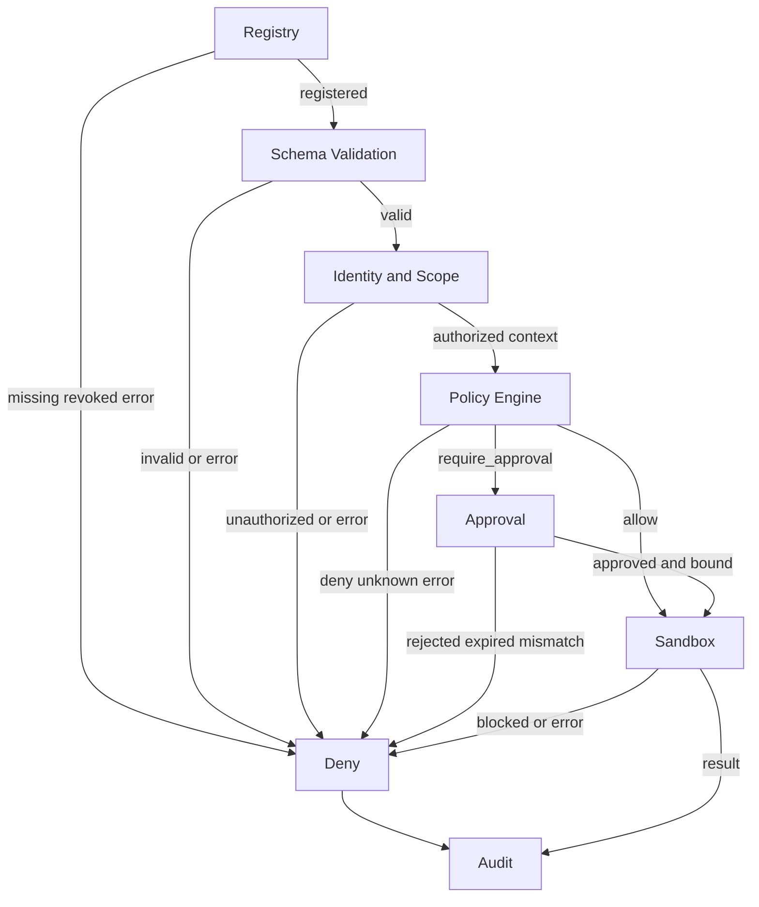

# 工具安全基线

## 1. 文档状态与适用范围

本文定义 `enterprise_agent` 工具系统的安全基线，覆盖工具注册、风险分级、调用校验、授权决策、人工审批、隔离执行、审计、密钥管理和提示词注入防护。总体模块边界见 [总体架构](architecture.md)，Graph 的 `authorize_tools`、`request_approval`、`execute_tools` 与恢复语义见 [Graph 流程](graph-flow.md)，Skill 的 `required_tools`、`risk_level`、精确版本与内容摘要契约见 [Skills 开发指南](skills-guide.md)。

**设计约定：**当前工作区没有可供核验的工具实现源码，因此本文描述的是必须由实现和测试兑现的目标契约，不表示这些控制已经上线。文中“必须”是安全强制要求，“应该”是推荐要求，“可以”是可选能力；带数值的默认值均为**建议实现**，上线前必须结合威胁评估和容量测试校准。

本文消费来自受信 API 身份上下文的 actor、`tenant_id` 与 scope，以及 Skill 声明的 `required_tools` 和 Graph 生成的规范化调用计划；本文输出风险等级、`allow` / `deny` / `require_approval` 策略决策、审批约束、沙箱配置和审计事件。本文不定义 Graph 状态迁移、Skill 生命周期或业务工具内部逻辑。

## 2. 安全目标、信任边界与不变量

安全目标是：只有经过注册、校验、授权且在批准范围内的调用，才能以最小权限产生预期副作用；任何不确定、失配或依赖不可用都必须 fail closed，并留下不含秘密的可追溯证据。

以下不变量不得由提示词、模型输出、Skill、工具返回值或客户端请求覆盖：

1. actor、`tenant_id`、角色、scope 和认证强度必须来自服务端验证的身份上下文；客户端或模型提供的同名字段只能视为不可信数据。
2. 模型只能提出结构化工具调用计划，Skill 只能声明候选 `required_tools`；**模型和 Skill 都不得决定授权、降低风险等级、签发审批或扩大 scope**。
3. 授权只能由受信的 Policy Engine 根据服务端事实和版本化策略作出。审批是额外条件，不是授权来源；历史批准不能覆盖当前已撤销的权限。
4. 工具执行必须依次通过 Registry、schema、身份/scope、策略、必要的审批复核和 Sandbox；任一阶段失败、超时或返回未知值都必须拒绝。
5. 风险分类是工具及调用上下文的安全标签，不等同于授权。即使是 `R0_READONLY`，也不能跳过租户、资源和参数范围校验。
6. 策略默认结果为 `deny`；只有显式、完整且仍有效的允许规则才能产生 `allow` 或 `require_approval`。
7. 审批不能扩展原始调用的工具、目标、参数、租户、actor、认证上下文、请求/授予的资源与 operation scope、有效期或使用上限；任何安全相关变化都必须重新校验、重新决策，并按需创建新审批。
8. 所有尝试，无论允许、拒绝、待审批、沙箱阻断、执行成功或失败，都必须产生可关联的审计事件。

## 3. 威胁模型

### 3.1 受保护资产与攻击者能力

受保护资产包括租户数据、业务系统状态、用户身份与授权、工具凭据、审批记录、幂等记录、审计证据、checkpoint、运行环境、网络访问能力和供应链完整性。

**设计约定：**威胁模型假定攻击者可以控制用户消息、上传文档、检索内容、外部网页、部分 Skill 内容、工具参数和外部工具响应；可以重放请求、并发提交审批回调、构造编码边界值，并诱导模型生成恶意调用计划。身份提供方、Policy Engine、审批事实库、secret manager 和审计存储属于高信任组件，但它们仍可能不可用或配置错误，系统必须 fail closed。

### 3.2 威胁与强制控制

| 威胁 | 典型路径 | 必须实施的控制 | 关键验证 |
|---|---|---|---|
| 提示词注入（含间接注入） | 用户、RAG 文本、Skill 正文或工具结果要求忽略策略、泄露数据或调用工具 | 指令与数据分离；结构化调用计划；固定授权链；模型/Skill 无授权能力；结果内容不得触发自动执行 | 对抗文本不能改变 tool、scope、risk 或 decision |
| 越权与跨租户访问 | 伪造 `tenant_id`、对象 ID、角色或审批人身份 | 身份取自受信上下文；资源级授权；repository 与工具适配器再次强制租户范围 | 租户 A 对租户 B 的读写成功数为 0 |
| 参数操纵 | 利用未知字段、类型转换、Unicode/URL 双重编码、边界值或批准后替换参数 | 严格 schema；拒绝未知字段；单次规范化；规范化后再摘要；执行前比对不可变参数 | 原值、审批值和执行值的 digest 必须一致 |
| 数据外泄 | 通过外部请求、工具输出、错误、日志、DNS 或超大响应带出秘密 | 最小数据投影；目的域 allowlist；输出裁剪与 DLP；日志脱敏；secret 不进 prompt | canary secret 不得出现在网络、输出、日志或 checkpoint |
| SSRF | URL 参数访问 loopback、私网、云 metadata、重定向目标或 DNS rebinding 地址 | 解析后校验 scheme/host/port/IP；禁止非批准域；每次重定向和连接前复核；统一 egress proxy | 阻断 `localhost`、link-local、private、metadata 与重绑定样例 |
| 命令注入 | 参数拼接进 shell、解释器、模板或子进程 | 默认禁止 shell；使用固定 executable 与参数数组；命令 allowlist；无 shell 展开；最小 OS 权限 | 元字符、换行、替换表达式只能作为字面参数或被拒绝 |
| 路径穿越 | `../`、绝对路径、符号链接、硬链接或竞态逃逸允许目录 | 目录句柄/安全文件 API；规范化后校验；拒绝符号链接逃逸；只读/读写挂载分离 | 编码穿越、symlink swap 与绝对路径均被阻断 |
| 重复副作用 | Graph 重试、超时、崩溃、重复审批回调或客户端重放导致重复写入 | 稳定幂等键；执行记录唯一约束；原子状态机；结果可查询；未知结果不得盲重试 | 并发与崩溃窗口只产生一次业务副作用 |
| 供应链风险 | 恶意或被替换的 Tool/Skill 包、镜像、依赖或 schema | 固定版本和内容摘要；签名/来源验证；依赖扫描；最小构建权限；变更复审与回滚 | 未签名、摘要不符或已撤销版本不能注册或执行 |

残余风险必须进入安全评审记录。不得用“模型会遵守提示”作为任何一项控制的替代品。

## 4. 四级风险模型

风险等级固定为以下四种。工具注册时必须声明静态最低等级；Policy Engine 必须根据目标、数据敏感度、参数、身份、环境和调用频率进行上下文升档。模型、Skill、调用者和工具适配器不得降档；只有经安全评审的版本化 registry 变更才能调整静态等级。

| 等级 | 判定边界 | 示例（仅用于分类） | 默认策略边界 |
|---|---|---|---|
| `R0_READONLY` | 无副作用，只读取调用者已获授权的低敏数据；不能扩大网络、文件或租户范围 | 查询本人可见的工单状态、读取批准目录内的公开模板 | 完成全部校验后可以 `allow`；失败或范围不明即 `deny` |
| `R1_INTERNAL_WRITE` | 修改本租户内部、可恢复或影响有限的状态，不对外代表用户发声 | 保存草稿、更新内部标签、写入可回滚的租户配置 | 必须显式策略允许；敏感目标、批量或不可逆变体应升档或 `require_approval` |
| `R2_EXTERNAL_WRITE` | 向外部系统写入、发送消息、创建订单或以用户/组织身份产生可见副作用 | 发送邮件、发布工单回复、提交外部业务请求 | 只能 `require_approval` 或 `deny`，不得自动 `allow` |
| `R3_PRIVILEGED` | 管理员/基础设施权限、高敏数据、资金、凭据、执行代码、大规模或难以恢复的操作 | 权限变更、密钥轮换、生产命令、批量删除、资金操作 | 只能 `require_approval` 或 `deny`；审批后仍必须复核当前权限和强隔离 |

**设计约定：**最终风险取“registry 静态等级”和“上下文规则计算等级”的较高者。一次调用同时命中多个工具或目标时必须逐项评估，不得以最低等级代表整个批次；无法拆分的批次按最高等级处理。风险等级缺失、未知、解析失败或策略数据陈旧时必须 `deny`。

**建议实现：**`R3_PRIVILEGED` 使用强认证、职责分离和双人复核；批量阈值、敏感字段集合及“可恢复”的业务定义由各租户安全策略版本化配置，不在提示词或 Skill 中维护。

## 5. 工具注册与供应链门禁

### 5.1 Registry 最小契约

**设计约定：**只有处于 `active` 状态且注册记录完整的精确工具版本可以进入授权链。每条记录至少包含：

| 字段 | 要求 |
|---|---|
| `tool_name`、`tool_version` | 稳定名称和不可变版本；调用必须精确解析，不允许静默漂移到 `latest` |
| `artifact_digest` | Tool 包、镜像或适配器的内容摘要；执行环境必须再次核对 |
| `input_schema`、`output_schema` | 版本化严格 schema；定义敏感字段、长度、枚举、格式和未知字段策略 |
| `minimum_risk` | 四级风险之一；缺失即不可注册 |
| `side_effect`、`idempotency_mode` | 是否产生副作用、幂等键接受方式、结果查询或补偿能力 |
| `allowed_scopes` | 工具需要的身份、资源与租户 scope 上限 |
| `sandbox_profile` | 网络、文件、命令和资源限制的不可变配置引用 |
| `secret_refs` | 只保存 secret manager 引用和用途，不保存秘密值 |
| `owner`、`review`、`status` | 责任人、安全评审证据、启用/撤销状态与时间 |

注册或更新必须验证来源、签名/摘要、schema、风险和 sandbox profile。Tool/Skill 内容摘要不匹配、版本撤销、依赖存在阻断级漏洞或 owner 不明确时必须拒绝注册。按照 [Skills 开发指南](skills-guide.md)，`required_tools[*].operations` 是候选能力 allowlist，`risk_level` 是包作者声明的最高预期风险而非可信授权证据，已选 Skill 必须固定 `(name, version, content_digest)`；这些字段可以进入策略上下文，但不会把工具自动加入租户 allowlist，也不能覆盖当前 Tool Registry 风险。

### 5.2 变更与撤销

工具 schema、执行制品、风险级别、scope、sandbox profile 或 secret 用途任一变化都必须产生新 registry 版本或不可变 revision，并触发安全测试。撤销必须立即阻止新调用；待审批和恢复中的调用在执行前必须复核 registry 状态，不得凭旧 checkpoint 继续。

## 6. 授权决策链

下图表达强制顺序。每个节点都必须输出结构化结果和 reason code；旁路、异常和未知结果都流向 `deny` 并进入 Audit。图中的 Approval 只验证已经由 Policy Engine 确定的不可变调用范围。



### 6.1 阶段契约

| 阶段 | 必须校验 | 失败行为 |
|---|---|---|
| Registry | 工具名、精确版本、active 状态、制品摘要、风险、schema、sandbox profile | `deny`；未注册工具不得尝试动态加载 |
| Schema Validation | 类型、required、enum/range/length、格式、未知字段、嵌套深度和规范化结果 | `deny`；不得让模型修补后在同一授权结果下执行 |
| Identity/Scope | actor、`tenant_id`、认证强度、角色/属性、资源所有权、目标租户、委托关系 | `deny`；身份依赖不可用必须 fail closed |
| Policy Engine | 工具版本、风险、规范化参数摘要、目标、环境、时间、频率、Skill 声明和策略版本 | 仅输出 `allow`、`deny`、`require_approval`；无匹配规则默认 `deny` |
| Approval | 审批终态、审批人权限、职责分离、绑定内容、有效期、一次性/使用次数和当前策略 | 拒绝、过期、撤销、失配或重复消费均 `deny` |
| Sandbox | 精确制品、最小凭据、网络/文件/命令/资源限制、幂等记录 | 阻断执行并审计；不得降级到非隔离执行 |
| Audit | 写入决策、状态变化与结果的脱敏事件 | 审计不可用时，写操作和高风险调用必须 fail closed |

### 6.2 参数规范化与 authorization binding digest

参数必须按“解析一次 → schema 校验 → 业务约束校验 → 资源解析 → 规范化序列化 → 计算 digest”的顺序处理。原始参数可为诊断目的保存于受限、加密的证据存储，但不得进入普通日志、prompt 或审批界面。

**设计约定：**授权、审批、Graph 中断恢复和执行必须共用唯一的 `authorization_binding_digest`，不得分别拼接字段或只比较 `parameter_digest`。平台唯一库 `enterprise_agent.tools.authorization_binding_v1` 必须生成和验证该摘要；算法 ID 固定为 `enterprise-agent.authorization-binding/v1`，输出格式固定为 `authbind-v1:sha256:` 加 64 个小写十六进制字符。算法、字段、规范化或编码变化必须使用新版本，不能在 `v1` 名称下静默改变。

摘要输入对象必须完整包含下列字段；缺失、未知字段或无法规范化都必须 `deny`：

| 字段 | 绑定语义 |
|---|---|
| `binding_schema` | 固定为 `enterprise-agent.authorization-binding/v1` |
| `actor`、`tenant_id` | 受信 actor 的稳定 ID/type 与服务端租户边界；不得取自模型或客户端覆盖值 |
| `auth_context_digest` | 对认证 issuer、subject、`auth_time`、认证强度、认证方法、会话/凭据句柄摘要、委托链及身份/entitlement revision 的版本化安全摘要；不得包含原始 token |
| `requested_scopes` | 原始请求的资源与 operation scope 集合；每项固定为规范化的 `resource_type`、`resource_id` 或受限 selector、`operation` |
| `granted_scopes` | Policy Engine 实际授予的资源与 operation scope 集合；必须是 `requested_scopes` 与当前权限的子集 |
| `tool`、`operation`、`tool_schema_digest`、`target` | 工具名、精确版本、制品摘要、单一计划 operation、对应 Registry revision 的 schema 摘要，以及目标系统、目标租户、资源类型和稳定目标 ID；`operation` 或 schema 摘要变化必须生成不同 binding |
| `normalized_parameters` | schema 与业务约束校验后的完整规范化参数；敏感值参与摘要但不进入审批正文、Graph 信封或普通审计 |
| `risk`、`policy_version` | 四级正式风险枚举之一和作出本次决定的精确策略版本 |
| `decision` | Policy Engine 的原始决定，只能是 `allow`、`deny` 或 `require_approval`；审批记录不得改写该值 |
| `approval_requirements` | `require_approval` 时由 Policy 输出的完整审批条件；必须至少包含审批人 scope、职责分离/禁止自批、审批认证强度、人数与次数要求；其他 decision 时必须为 `null` |
| `idempotency_key` | 服务端生成的稳定幂等键；不能包含可逆秘密 |
| `validity` | `not_before`、`expires_at` 与 `max_uses`；时间和使用上限都属于授权范围 |

`auth_context_digest` 必须由受信身份适配器采用独立的 `authctx-v1` 确定性协议计算：对包含 issuer、subject、`auth_time`、认证强度、排序去重后的认证方法、会话/凭据句柄不可逆摘要、规范化委托链、身份与 entitlement revision 的严格对象执行下述 NFC、scope 之外数组的 schema 顺序、RFC 8785 和 SHA-256 步骤，输出 `authctx-v1:sha256:` 加 64 个小写十六进制字符。认证强度、认证方法、委托关系、会话/凭据句柄、角色或 entitlement revision 任一安全属性变化都必须得到不同摘要。原始身份令牌、cookie、密钥和 assertion 正文不得进入任何 binding 对象或持久化记录。

确定性编码必须遵守以下顺序：

1. 所有字符串先验证为合法 UTF-8，再规范化为 Unicode NFC；ID、operation、risk 和版本字段还必须通过各自严格 schema。
2. scope 项使用结构化 resource + operation 表示，按 `(resource_type, resource_id_or_selector, operation)` 的 UTF-8 字节序排序并去重；不得把空 scope、通配 scope 和缺失 scope 视为等价。
3. `approval_requirements.required_approver_scope` 必须是经严格 schema 校验并按 NFC 规范化的非空 scope；职责分离规则、认证强度、审批人数与次数必须使用固定枚举或正整数，空对象、`null` 和缺失不得视为等价。
4. 时间统一为 UTC RFC 3339 秒精度，`max_uses` 为正整数；参数对象保留业务数组顺序，不做有损字符串化或隐式类型转换。
5. 对完成规范化的完整对象使用 RFC 8785 JSON Canonicalization Scheme 生成 UTF-8 字节，计算 SHA-256，再加上述版本化前缀。摘要比较必须使用常量时间比较。

`approval_requirements` 是严格、版本化对象，必须完整表达本次 Policy 要求，至少包含：`required_approver_scope`、`separation_of_duties.prohibit_self_approval`、`separation_of_duties.require_distinct_approvers`、`required_approver_auth_strength`、`min_distinct_approvers` 和 `approvals_required`。`min_distinct_approvers` 与 `approvals_required` 必须为正整数，且所需有效批准数不得小于最少不同审批人数；实现不得把未进入对象的口头约定、UI 默认值或模型摘要当作审批条件。若策略新增多个审批 scope、审批地域、组织、设备、时间窗或其他资格条件，必须先扩展到新 binding schema/version，再允许执行。

Policy Engine 必须在得出 `decision`、`granted_scopes`、risk、完整 `approval_requirements` 和有效期/使用上限后构造绑定对象并计算摘要。对于 `require_approval`，审批聚合记录及每条审批人决定必须保存同一 `binding_schema` 与 `authorization_binding_digest`；Graph 的待审批/恢复信封必须携带同一二元组；executor 必须用当前受信身份事实、当前请求/授予 scope、当前工具名、精确版本、制品摘要、单一 `operation`、当前 `tool_schema_digest`、目标、实际规范化参数、当前 risk/策略、原始 Policy decision、完整审批条件、原幂等键和原有效期/使用上限重建并重新计算摘要。

执行前必须对 Policy 决策记录、审批记录（需要审批时）、Graph 信封和 executor 重算值进行全相等比较。actor、`tenant_id`、`auth_context_digest`、requested/granted resource-operation scope、工具名/精确版本/制品摘要、单一 `operation`、`tool_schema_digest`、目标、规范化参数、risk、策略版本、`decision`、任何审批条件、幂等键、有效期或使用上限任一变化，都必须使旧 binding 失效并重新执行 Registry、Schema Validation、Identity/Scope 和 Policy Engine；新结果仍为 `require_approval` 时必须创建新审批。不得通过只更新 Graph 信封、只重算 `parameter_digest` 或沿用旧 `approval_id` 修补失配。

`deny` 是不可提升的终态：审批服务必须拒绝为 `decision = deny` 的 binding 创建、附加或接受审批，Graph 不得把任何 `approved` 回调转换为可执行状态，executor 也不得接收该 binding。`allow` 的 `approval_requirements` 必须为 `null`，不能通过补交审批改变其范围。审批只用于证明 `decision = require_approval` 的全部绑定条件已经满足，不能修改原 decision；decision 或审批条件变化必须生成新摘要并重新决策。

必须特别处理：

- JSON 重复键、非有限数值、超深嵌套、超长字符串和未知字段必须拒绝。
- URL 必须限制 scheme、host、port、重定向次数和解析后 IP；不能只用字符串前缀判断 SSRF。
- 文件路径必须绑定 sandbox 根目录；规范化、符号链接解析和实际打开操作之间必须避免竞态。
- 命令型工具只能选择 registry 中的固定 executable 和参数模板；模型不得提供 shell 片段、环境变量名或工作目录。
- 目标 ID 必须在服务端解析为当前租户可访问资源；不得把“ID 格式合法”等同于“actor 有权访问”。
- 批量参数必须有数量、总大小和影响上限；超过上限应拆分并重新授权，不能静默截断后沿用原审批。

### 6.3 Policy Engine 输入输出

**设计约定：**Policy Engine 必须是确定性的受信服务或库，不调用 LLM 作最终授权。以下 JSON 是接口示意，示例标识均为虚构测试值：

```json
{
  "input": {
    "actor_id": "user_demo_42",
    "tenant_id": "tenant_demo",
    "auth_context_digest": "authctx-v1:sha256:aaaaaaaaaaaaaaaaaaaaaaaaaaaaaaaaaaaaaaaaaaaaaaaaaaaaaaaaaaaaaaaa",
    "tool": {"name": "ticket.reply", "version": "2.1.0", "artifact_digest": "sha256-v1:bbbbbbbbbbbbbbbbbbbbbbbbbbbbbbbbbbbbbbbbbbbbbbbbbbbbbbbbbbbbbbbb"},
    "operation": "reply",
    "tool_schema_digest": "sha256-v1:eeeeeeeeeeeeeeeeeeeeeeeeeeeeeeeeeeeeeeeeeeeeeeeeeeeeeeeeeeeeeeee",
    "risk": "R2_EXTERNAL_WRITE",
    "target": {"system": "ticket_demo", "tenant_id": "tenant_demo", "type": "ticket", "id": "ticket_demo_314"},
    "normalized_parameters": {"body": "示例回复，仅用于接口说明"},
    "requested_scopes": [{"resource_type": "ticket", "resource_id": "ticket_demo_314", "operation": "reply"}],
    "idempotency_key": "idem_demo_ticket_314_reply_01",
    "skill": {"name": "support_reply", "version": "1.4.0", "content_digest": "sha256-v1:cccccccccccccccccccccccccccccccccccccccccccccccccccccccccccccccc"},
    "policy_version": "policy_demo_2026_07"
  },
  "output": {
    "decision": "require_approval",
    "reason_code": "external_write_requires_human",
    "granted_scopes": [{"resource_type": "ticket", "resource_id": "ticket_demo_314", "operation": "reply"}],
    "approval_requirements": {
      "required_approver_scope": "ticket:approve_reply",
      "separation_of_duties": {"prohibit_self_approval": true, "require_distinct_approvers": true},
      "required_approver_auth_strength": "mfa",
      "min_distinct_approvers": 1,
      "approvals_required": 1
    },
    "validity": {"not_before": "2026-07-15T12:00:00Z", "expires_at": "2026-07-15T12:15:00Z", "max_uses": 1},
    "binding_schema": "enterprise-agent.authorization-binding/v1",
    "authorization_binding_digest": "authbind-v1:sha256:dddddddddddddddddddddddddddddddddddddddddddddddddddddddddddddddd"
  }
}
```

`decision` 只能是 `allow`、`deny`、`require_approval`，且每一种 decision 都必须参与 `authorization_binding_digest`。当 decision 为 `require_approval` 时，`approval_requirements` 必须存在、完整且通过严格 schema；当 decision 为 `allow` 或 `deny` 时，该字段必须精确为 `null`。示例中的摘要值仅演示格式，不是 golden vector。缺字段、额外 decision、审批条件不完整、反序列化失败、策略超时、策略版本未知、binding 构造失败或依赖数据过期时，调用方必须把结果归一为新的 `deny` 决策证据；不得沿用或局部修改旧摘要。reason code 可以进入审计，但面向用户的错误不得泄露可用于探测策略的内部细节。

## 7. 人工审批与绑定

### 7.1 审批展示内容

审批界面必须清晰展示以下内容，且展示值来自授权链的规范化快照，不得由模型临时总结后替代：

- 工具名称和精确版本；
- 目标系统、资源类型、目标 ID 与目标租户；
- 参数摘要和经允许的关键字段预览，敏感值必须遮蔽；
- 预期影响、是否可撤销、失败或部分成功后果；
- 请求 actor、请求来源、risk 和请求时间；
- 请求与实际授予的 resource-operation scope、认证强度摘要及其差异；
- Policy decision，以及 `require_approval` 的审批人 scope、职责分离/禁止自批、审批认证强度、最少不同审批人数和所需有效批准次数；
- 审批有效期 `expires_at`、允许使用次数与审批人所需 scope；
- 幂等键及其不可逆摘要，供识别重复动作；
- 策略版本、工具制品摘要、单一 `operation`、`tool_schema_digest`、binding schema 和 `authorization_binding_digest`。

审批人必须能选择批准或拒绝，且系统必须记录决定时间和理由码。审批界面不得提供直接修改参数后“顺便批准”的能力；如需修改，系统必须创建新调用计划，重新执行 Registry、schema、Identity/Scope 与 Policy Engine。

### 7.2 不可变绑定与执行时复核

**设计约定：**`approval_id` 必须关联不可变的 `binding_schema` 与 `authorization_binding_digest`，由该摘要机械绑定 actor、`tenant_id`、`auth_context_digest`、requested/granted resource-operation scope、工具名/精确版本/制品摘要、单一 `operation`、`tool_schema_digest`、目标、完整规范化参数、risk、策略版本、Policy `decision`、完整 `approval_requirements`、幂等键、有效期和使用上限；审批聚合记录及每条审批人决定另行记录审批人身份、决定与时间，但都必须引用同一摘要。批准记录应使用不可变终态；对同一审批的相同回调幂等返回原终态，冲突回调必须拒绝并产生安全事件。

执行前必须重新读取审批事实库并验证：

1. 状态是 `approved`，未过期、未撤销且未超使用上限；
2. Policy 决策记录、审批记录、Graph 信封和 executor 当前重算的 `binding_schema` 与 `authorization_binding_digest` 全部相等，不能只比较模型生成摘要或 `parameter_digest`；
3. 绑定 decision 精确为 `require_approval`，所有有效批准者分别满足绑定的 approver scopes 与认证强度，禁止自批和职责分离规则成立，不同审批人数及有效批准次数均达到绑定门槛；
4. 每条审批决定引用同一 binding，审批人集合已去重，拒绝、撤销、过期或冲突决定不能计入 quorum；
5. actor 当前仍有基础权限，registry 制品仍 active，策略没有变为更严格的拒绝；
6. 幂等记录不存在冲突执行，或已有结果可安全返回。

审批不得扩展原始参数或 scope 范围，也不得改写 Policy decision 或降低审批资格/人数/次数门槛。审批只解除 `require_approval` 这一额外门槛，不能把原本 `deny` 的调用改为 `allow` 或可执行。actor、租户、认证安全属性、请求或授予 scope、工具、目标、参数、risk、策略、decision、任何审批条件、幂等键、有效期或使用上限发生任何变化时，必须废弃旧 binding 并重新决策；需要审批时创建新 `approval_id`。过期、拒绝、binding 失配、权限撤销、策略升级、工具版本变化或审批存储不可用时必须 `deny`。

### 7.3 幂等与重复副作用

所有 `R1_INTERNAL_WRITE`、`R2_EXTERNAL_WRITE` 和 `R3_PRIVILEGED` 调用必须携带稳定幂等键。**建议实现：**幂等键由服务端根据 `tenant_id`、稳定 `call_id`、工具版本和规范化参数摘要派生；键本身不得包含可逆敏感值。幂等记录必须使用唯一约束和原子状态机（例如 `reserved`、`running`、`succeeded`、`failed_known`、`unknown`），保留期覆盖 checkpoint 与审批的最长可恢复期。

超时或进程崩溃后，executor 必须先按幂等键查询既有结果。外部系统不支持幂等且结果未知时不得自动重试；必须标记 `unknown` 并转人工核对。补偿操作是新的副作用，必须有独立工具定义、风险判断和授权，不得假设原审批自动覆盖补偿。

## 8. 沙箱与执行隔离

### 8.1 强制限制

**设计约定：**每个工具版本必须绑定不可由调用参数覆盖的 `sandbox_profile`。executor 只接收已授权的不可变计划，使用最小权限的短期凭据，并在隔离进程或等价隔离边界执行。生产环境不得因 sandbox 服务不可用而回退到宿主进程执行。

| 维度 | 必须限制 | 实现与验证要点 |
|---|---|---|
| 网络域名 | 默认无网络；按工具允许精确 scheme/域名/端口和必要路径 | 统一 egress proxy；禁止通配符顶级域；重定向和每次连接前复核 DNS/IP；阻断私网、loopback、link-local、metadata |
| 文件路径 | 默认临时空目录；只读与读写目录分别 allowlist | 固定工作目录；禁止宿主根目录、socket、设备和 secret 目录；安全解析 symlink/hardlink；退出后清理 |
| 命令 | 默认不允许启动子进程；确需时只允许固定 executable + 参数数组 | 禁止 shell、`eval`、动态解释器和用户提供环境变量；清空非必要环境；使用非 root UID |
| CPU | 每次调用与租户并发都设置配额 | 超限终止并记录 sandbox reason；不得无限后台运行 |
| 内存 | 设置进程和容器硬上限，禁止 swap 中残留秘密 | OOM 作为受控失败；结果状态不得误报成功 |
| 时间 | 设置连接、读取、工具总时限和取消传播 | 超时后终止子进程；有副作用时查询幂等状态，不盲目重试 |
| 输出大小 | 限制 stdout、stderr、文件、网络响应和最终结构化结果 | 超限截断或拒绝；先做 schema/恶意内容扫描再进入 Graph；原始大对象转受控引用 |

**建议实现的初始上限：**普通调用 1 vCPU、512 MiB、30 秒、结构化结果 64 KiB；这些数值不是已实现事实，必须按工具 profile 单独压测。提高上限属于 registry/sandbox profile 变更，不能由模型、Skill 或单次参数提出并立即生效。

### 8.2 网络、文件与命令细化

- SSRF 防护必须在 URL 规范化后、DNS 解析后、TCP 连接前以及每次重定向时执行；代理必须阻断 IPv4/IPv6 非批准地址，且不能信任外部 DNS 返回的初次结果永久有效。
- 工具对外发送的数据必须先按目的和字段 allowlist 做最小化投影；认证头由 executor 注入，模型不能读取或覆盖。
- 文件访问应该基于预先打开的目录句柄和内核级隔离，避免“校验路径后再打开”的 TOCTOU；上传/下载文件必须经过类型、大小和恶意内容检查。
- 命令参数必须使用无 shell 的 argv 传递。若业务确实需要脚本执行，应将脚本做成经签名、固定摘要的工具制品，并按 `R3_PRIVILEGED` 评估，而不是执行模型生成代码。
- sandbox 输出始终是不可信数据；必须验证 output schema、裁剪错误、移除控制字符，并标记来源后才能反馈给模型。

## 9. 审计、监控与响应

### 9.1 审计事件

每个阶段必须发出追加式、结构化且可按 `trace_id` 关联的事件。审计记录至少包含以下字段；字段名为**设计约定**，实现可以增加字段但不得省略其语义：

| 字段 | 语义与保护要求 |
|---|---|
| `event_id`、`occurred_at` | 唯一事件 ID 与服务端时间；支持顺序和去重 |
| `actor`、`tenant` | 受信 actor ID、actor type、认证强度与 `tenant_id`；不记录完整身份令牌 |
| `tool`、`operation`、`tool_schema_digest`、`risk` | 工具名、精确版本、制品摘要、单一 operation、Registry schema 摘要与四级 risk |
| `decision` | `allow`、`deny` 或 `require_approval`，以及稳定 reason code、策略版本 |
| `approval` | `approval_id`、状态、审批人 ID、决定时间和过期时间；无审批时为显式空值 |
| `parameter_digest` | 基于规范化参数的不可逆摘要；普通日志不保存敏感原值 |
| `authorization_binding` | `binding_schema` 与 `authorization_binding_digest`；摘要覆盖 decision 和完整审批条件，用于对账 Policy、审批、Graph 信封和执行值 |
| `target`、`scope` | 脱敏目标标识、目标租户和请求/授予 scope |
| `result_status` | `blocked`、`pending`、`succeeded`、`failed_known`、`unknown` 等明确状态 |
| `latency` | 决策、审批等待和执行耗时分开记录 |
| `trace` | `trace_id`、`thread_id`、Graph run ID、call ID 与幂等键摘要 |
| `sandbox` | profile/revision、阻断原因、资源用量和输出大小 |

审计事件必须在持久化前脱敏、传输加密、静态加密并受访问控制、保留和防篡改策略保护。高敏原始参数若依法必须留存，应进入与普通日志隔离的加密证据库，使用单独权限和访问审计。指标标签不得使用原始参数、用户文本、目标 ID 或其他高基数字段。

### 9.2 必须告警的事件

以下情况必须触发安全监控：未注册工具、跨租户尝试、审批绑定失配、decision 替换、审批资格或 quorum 降级、自批/职责分离违规、对 `deny` 注入审批、重复冲突回调、risk 降档尝试、SSRF/路径/命令 sandbox 阻断、secret canary 命中、同一 actor 大量拒绝、制品摘要不符、审计写入失败以及幂等状态长期为 `unknown`。告警应带 `trace_id` 和脱敏证据，不得附带 secret 或完整高敏正文。

## 10. 密钥与凭据管理

1. 密钥必须存放在 secret manager，由 executor 在执行边界按工具、租户、环境和用途动态注入；registry、调用计划与审批只保存不可解引用的 `secret_ref`。
2. 密钥和完整 token **禁止进入 prompt、日志、checkpoint、审批正文、审计参数、指标标签、异常消息和错误正文**，也不得写入源码、镜像层、Tool/Skill 包或临时输出文件。
3. executor 必须使用最小 scope、短有效期和可撤销凭据。能够使用工作负载身份或一次性令牌时，不应分发长期静态密钥。
4. 凭据只能注入到声明用途对应的请求头、文件描述符或进程环境；模型、Skill 和工具参数不得选择 secret 名称、读取 secret 值或把凭据转发到其他域。
5. 日志和异常出口必须使用字段级 allowlist 与 secret 扫描双重保护；依赖库的调试日志默认关闭，HTTP 认证头和连接字符串必须整体遮蔽。
6. secret manager 不可用、引用与工具/租户不匹配或轮换状态不明确时必须拒绝执行，不能从旧 checkpoint、缓存或日志恢复秘密。
7. 密钥访问、轮换、撤销和失败必须单独审计。发现泄露时必须立即撤销、轮换、隔离受影响工具版本并回溯相关 trace。

## 11. 提示词注入与不可信内容防护

提示词注入防护的核心不是寻找“安全提示词”，而是保证不可信文本无法进入授权控制面：

- 用户消息、RAG 片段、网页、文件、Skill 正文、工具输出和错误文本都必须标记为不可信数据，并放入与系统策略分离的结构化字段。
- 模型只能从 registry 提供的受限视图选择候选工具并生成参数草案；服务端必须重新解析工具版本、规范化参数和目标，不能接受模型给出的 risk、scope、`tenant_id`、decision、`approval_id` 或 secret 引用。
- Skill 可以声明 `required_tools`、输入 schema 和风险提示，但声明不是授权。Policy Engine 必须将 Skill 名称/版本/摘要作为不可信或低信任上下文，并独立校验租户允许的 Skill 与工具交集。
- 检索文本或工具结果中的 URL、命令、文件路径、工具名和“批准”字样不得触发自动访问、执行或恢复；新的动作必须形成新调用计划并完整经过授权链。
- 工具输出必须做 schema、长度、内容类型和敏感数据检查。输出反馈给模型时应带清晰数据边界，禁止拼接进系统指令；输出中的工具调用格式只能作为文本。
- 任何让模型“自检是否有权限”或让 Skill “确认调用安全”的步骤只能用于辅助解释，不得影响 Policy Engine 的最终 decision。

## 12. 异常、降级与安全失败

| 异常 | 必须行为 |
|---|---|
| Registry/schema/身份/Policy 依赖不可用 | `deny`；不得复用旧的宽松决策或绕过校验 |
| Policy 返回未知 decision 或超时 | 归一为 `deny` 并审计协议错误 |
| 审批服务不可用或审批过期 | 保持中断或安全结束；不得执行待批动作 |
| Sandbox 启动失败或限制无法应用 | 拒绝执行；不得回退到宿主或宽松 profile |
| 审计服务不可用 | `R1_INTERNAL_WRITE`、`R2_EXTERNAL_WRITE`、`R3_PRIVILEGED` 和任何写操作必须 fail closed；`R0_READONLY` 是否允许只读降级需经版本化策略明确允许并使用受保护本地缓冲 |
| 工具超时且副作用未知 | 标记 `unknown`，按幂等键查询或人工核对，不自动重试 |
| 输出 schema 失败、过大或含敏感内容 | 不把原始结果反馈给模型；记录脱敏失败摘要并按工具语义处置 |

降级不得削弱身份、租户、授权、审批、隔离或秘密保护。面向用户的错误应说明操作未执行、待确认或被拒绝的状态，但不能回显策略内部条件、凭据、堆栈或未裁剪的依赖响应。

## 13. 安全测试基线

上线前必须在单元、契约、集成、端到端和对抗层覆盖下列测试。所有测试都必须断言业务副作用、decision、审计事件和敏感数据泄露，而不只断言 HTTP 状态码。

| 测试域 | 必测用例 | 通过条件 |
|---|---|---|
| 默认拒绝 | 未注册工具、未知版本、缺失 risk、无匹配策略、未知 decision、依赖超时 | 全部 `deny`，无工具执行，存在 reason code 与审计事件 |
| 身份与租户 | 伪造 `tenant_id`、同 ID 跨租户、认证强度/方法/委托/entitlement revision 变化、撤权后恢复、审批人越权 | 跨租户读写成功数为 0；`auth_context_digest` 变化使旧 binding 失效，旧审批不能绕过当前权限 |
| 参数、工具 schema 与 scope binding | 未知字段、重复键、编码混淆、边界值、批准后替换参数、扩大 requested/granted resource-operation scope、替换 operation、schema digest 漂移、摘要碰撞回归 | schema 拒绝或 `authorization_binding_digest` 失配；Policy、审批、Graph 信封与执行重算值完全一致 |
| 注入 | 用户/RAG/Skill/工具输出分别包含提权、泄密、调用和伪造审批指令 | risk、scope、decision 和调用链不受文本影响 |
| SSRF | loopback、IPv4/IPv6 私网、metadata、DNS rebinding、跨域重定向 | egress 在连接前阻断并产生 sandbox 安全事件 |
| 命令/路径 | shell 元字符、换行、`../`、双重编码、symlink/hardlink/TOCTOU | 不能执行额外命令或逃逸允许目录 |
| 审批与 decision binding | `allow`/`deny`/`require_approval` 替换，审批人 scope/认证强度降低，人数或次数门槛降低，自批、职责分离失败、过期、撤销、binding 版本/摘要失配、冲突回调、重复消费 | `deny` 不能通过审批变为可执行；任一 decision/条件/绑定变化均触发重新决策，必要时新审批；未满足完整 quorum 不执行 |
| 幂等 | 并发请求、工具成功后崩溃、结果写回前重启、外部超时 | 最多一次业务副作用；未知状态不盲重试 |
| Sandbox | 域名/路径/命令越界、CPU/内存/时间/输出超限 | 进程被限制或终止，宿主和其他租户不受影响 |
| 密钥与审计 | canary secret 注入、异常/超时/调试日志、checkpoint 与审批扫描 | prompt、日志、checkpoint、错误正文和输出均无 canary 明文 |
| 供应链 | 未签名制品、摘要篡改、撤销版本、恶意依赖 | 不能注册或执行，产生供应链审计与告警 |

安全关键用例必须在每个 Tool/Skill/Policy 版本变更后回归。生产应使用合成 canary、拒绝率、sandbox 阻断、审批失配和幂等 `unknown` 指标做持续监测；测试中的示例身份和资源必须是隔离的虚构数据。

## 14. 实现与评审清单

- [ ] Registry 只解析 active 的精确版本，并在执行前复核制品摘要、单一 `operation`、`tool_schema_digest` 与撤销状态。
- [ ] 四级风险只使用 `R0_READONLY`、`R1_INTERNAL_WRITE`、`R2_EXTERNAL_WRITE`、`R3_PRIVILEGED`，上下文只能升档不能由模型/Skill 降档。
- [ ] Policy Engine 只输出 `allow`、`deny`、`require_approval`，所有未知或缺省情况默认 `deny`。
- [ ] schema、Identity/Scope、资源所有权和目标租户均由服务端校验，客户端/模型字段不能成为授权事实。
- [ ] `authorization_binding_digest` 按版本化确定性协议覆盖 actor、tenant、认证上下文、requested/granted resource-operation scope、工具名/精确版本/制品摘要、单一 `operation`、`tool_schema_digest`、目标、规范化参数、risk、策略、Policy decision、完整审批条件、幂等键、有效期和使用上限。
- [ ] Policy 决策、`approval_id` 记录、Graph 信封和 executor 重算值严格比较同一 binding；任一变化重新决策，必要时新审批，审批不能扩大原范围。
- [ ] `require_approval` 完整绑定审批人 scope、禁止自批/职责分离、审批认证强度、不同审批人数和有效批准次数；`deny` 不能被任何审批转换为可执行状态。
- [ ] Sandbox 强制限制网络域名、文件路径、命令、CPU、内存、时间和输出大小，失败时不回退。
- [ ] 每次尝试都记录 actor、tenant、tool、risk、decision、approval、parameter digest、result status、latency 和 trace。
- [ ] secret 只由 secret manager 在执行边界注入，且不会进入 prompt、日志、checkpoint 或错误正文。
- [ ] 提示词注入、越权、参数操纵、数据外泄、SSRF、命令注入、路径穿越、重复副作用和供应链风险均有负向测试。
- [ ] 与 [总体架构](architecture.md)、[Graph 流程](graph-flow.md) 和 [Skills 开发指南](skills-guide.md) 的身份、审批、checkpoint、`required_tools`、`risk_level`、版本/内容摘要、幂等和审计语义一致。